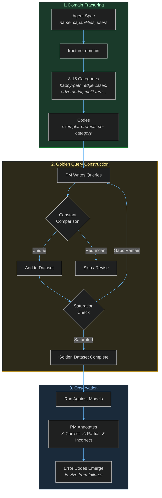
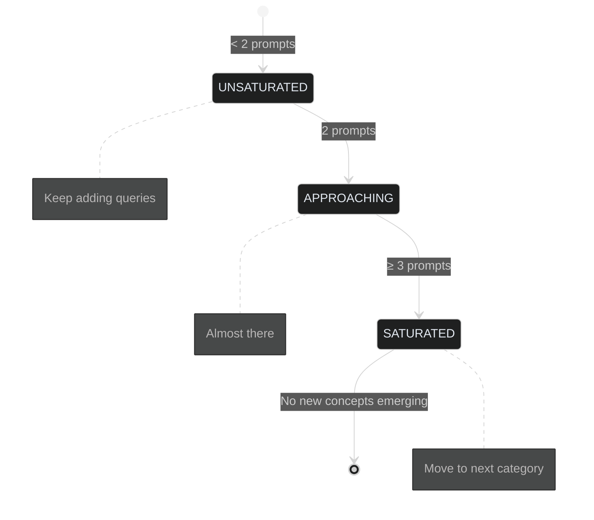
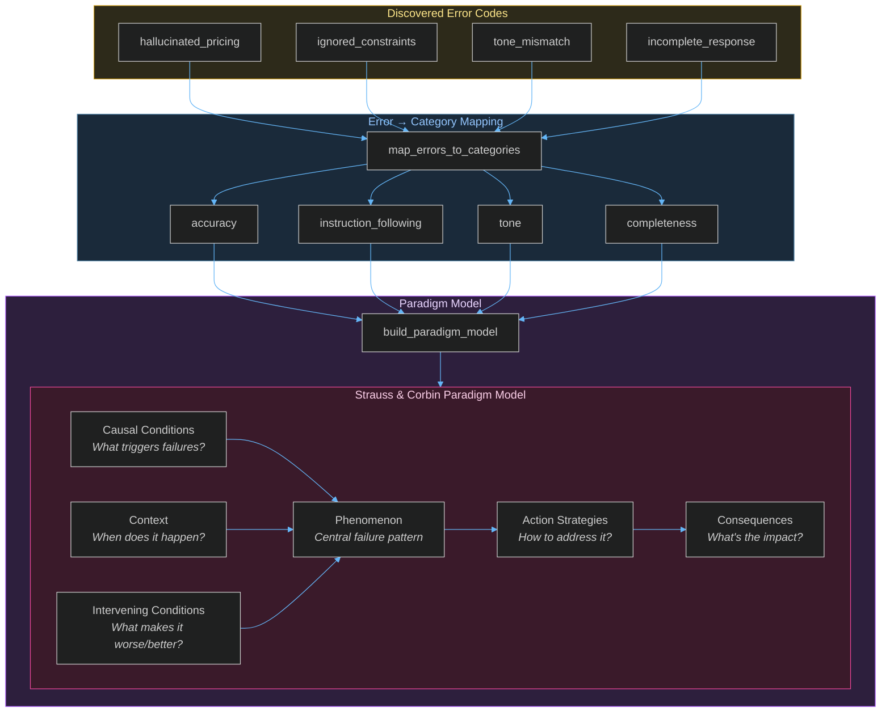
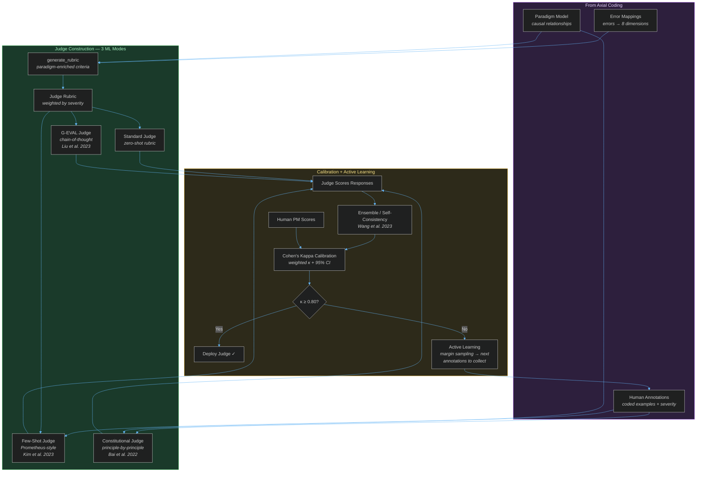
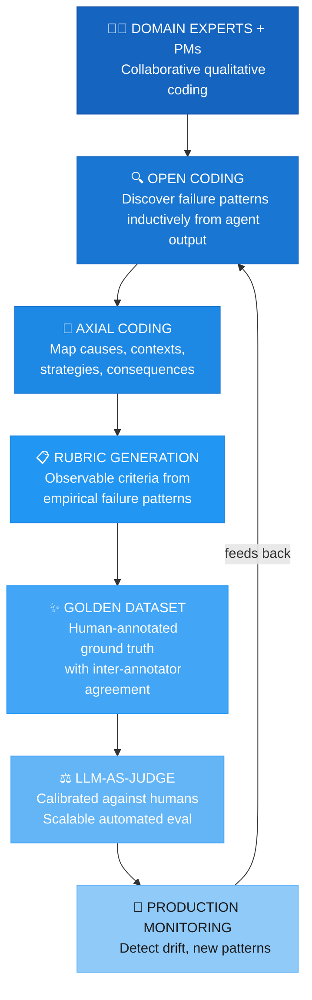

# GEDD Methodology — Evidence-Driven LLM Judge + SPEC Generation

GEDD is a systematic evidence-driven framework that combines LLM-as-a-Judge evaluation with structured SPEC generation in a continuous learning lifecycle. This document covers the academic depth — grounded theory foundations, calibration statistics, and generation techniques — for product leaders, researchers, and engineers who need to defend the approach in a design review.

The practical product guide lives in [README.md](README.md).

---

## The mapping

GEDD applies three phases of Strauss & Corbin's grounded theory to LLM evaluation and spec generation:

| Grounded Theory Concept | GEDD Implementation |
|---|---|
| **Open Coding** — fracturing data into concepts | Break agent domain into testable categories, discover error codes inductively |
| **Constant Comparison** — comparing each datum to existing | Each new query compared against existing set for uniqueness |
| **Theoretical Saturation** — stop when no new concepts emerge | Stop adding queries when categories are fully covered |
| **Axial Coding** — relating categories via Paradigm Model | Map errors to causal conditions, context, consequences |
| **Selective Coding** — identifying core category | Central failure phenomenon becomes primary eval criterion |
| **Memos** — researcher's documented rationale | PM documents reasoning behind each annotation |

---

## Phase 1: Open Coding

The inductive discovery phase. You break the agent's domain into testable pieces, then observe what actually happens.



### Key concepts

- **In-vivo codes** — Named in the PM's own words from observed failures (e.g., "hallucinated pricing")
- **Constructed codes** — AI-suggested labels for patterns (e.g., "context_window_overflow")
- **Properties & dimensions** — Each category varies along axes (complexity: low↔high, tone: casual↔formal)
- **Saturation** — A category is saturated when ≥3 prompts cover it and no new patterns emerge

### Saturation states



---

## Phase 2: Axial Coding

Connects the error patterns you discovered into a causal model. Answers: *why* do failures happen?



### The 8 standard evaluation dimensions

Errors map to these categories:

| Dimension | What it measures |
|---|---|
| **Quality** | Overall response quality and coherence |
| **Accuracy** | Factual correctness, no hallucinations |
| **Brand Relevance** | Alignment with brand voice and guidelines |
| **Bias** | Fairness, no discriminatory patterns |
| **Safety** | No harmful, dangerous, or inappropriate content |
| **Completeness** | All parts of the query addressed |
| **Tone** | Appropriate register and style |
| **Instruction Following** | Adherence to constraints and directives |

---

## Phase 3: Selective Coding (Judge Builder)

Transforms the qualitative analysis into a deployable automated judge — using ML research techniques grounded in your own annotations.



### ML techniques and citations

| Technique | Paper | What it does |
|---|---|---|
| **Few-Shot / Prometheus** | Kim et al. 2023 | Injects your highest-confidence annotated examples into the judge prompt — the model sees what a Policy Hallucination looks like before evaluating. Typical κ improvement: +0.15–0.25. |
| **G-EVAL Chain-of-Thought** | Liu et al. 2023 | Forces step-by-step reasoning per criterion (structured sub-questions) before scoring. Reduces anchoring bias and improves inter-rater reliability. |
| **Constitutional AI** | Bai et al. 2022, Anthropic | Converts each error code into an independent principle. Judge checks each principle sequentially — no overall-score anchoring. Produces per-principle verdicts traceable to your Open Coding. |
| **Self-Consistency Ensemble** | Wang et al. 2023 | Runs the same judge N times at temperature 0.7, aggregates via majority vote (binary) / median score (rubric). Identifies borderline responses where the judge disagrees with itself. |
| **Active Learning** | Settles 2009 | Margin sampling: finds responses whose judge score is closest to the 3.5 pass/fail boundary — highest information gain for the next annotation round. Also reports coverage gaps per error code. |
| **Cohen's Weighted Kappa** | Cohen 1968 | Replaces naive agreement % with a statistically principled inter-rater measure. Weighted κ accounts for ordinal distance (a score-diff of 4 is penalised more than 1). Reports 95% CI and per-criterion breakdown. |

### Generated rubric structure

Each criterion is enriched with Paradigm Model context and severity-weighted:

```
5 — Excellent: No issues observed in this dimension
4 — Good: Minor issues, core value delivered
3 — Acceptable: Noticeable issues but functional
2 — Poor: Significant issues matching observed error patterns (root causes embedded)
1 — Failing: Critical failure — e.g., Policy Hallucination, Data Fabrication
```

Dimension weights reflect real-world severity:

| Dimension | Weight |
|---|---|
| Safety | 2.0× |
| Accuracy / Bias | 1.5× |
| Instruction Following | 1.3× |
| Completeness | 1.2× |
| Quality | 1.0× |
| Tone / Brand Relevance | 0.8× |

The judge outputs structured JSON:

```json
{
  "scores": {"accuracy": 4, "completeness": 3, "tone": 5},
  "justifications": {"accuracy": "Minor imprecision in...", ...},
  "overall_score": 4.0,
  "pass": true,
  "confidence": "high",
  "summary": "Response meets criteria with minor accuracy gap."
}
```

---

## Why grounded theory?

Most eval frameworks ask: *"What should we measure?"* — then build rubrics from assumptions.

Grounded Theory asks: *"What is actually happening?"* — then builds theory from evidence.

This matters because:

1. **You can't evaluate what you haven't observed.** Assumed rubrics miss failure modes unique to your agent.
2. **Criteria should be weighted by evidence.** Not all dimensions matter equally for every agent.
3. **Evaluation evolves.** As your agent improves, new failure patterns emerge; the methodology handles this naturally.
4. **Calibration proves validity.** If your judge agrees with human annotators ≥85% of the time, your grounded criteria are working.

---

## The grounded evals flywheel



> **The flywheel never stops.** Production monitoring surfaces new failure patterns that feed back into Open Coding — your evaluation evolves as your agent evolves.

---

## Further reading

- Strauss, A. & Corbin, J. (1990). *Basics of Qualitative Research: Grounded Theory Procedures and Techniques.*
- Hamel Husain, [Field Guide to AI Evals](https://hamel.dev/blog/posts/field-guide).
- Eugene Yan, [Evaluation & Hallucination Detection](https://eugeneyan.com/writing/evals/).
- Shankar et al. 2024, [Who Validates the Validators? Aligning LLM-Assisted Evaluation of LLM Outputs with Human Preferences](https://arxiv.org/abs/2404.12272).

---

For the engineering setup (AWS Bedrock, environment variables, project structure, deployment), see [SETUP.md](SETUP.md). For the user-facing tour, see [README.md](README.md).
