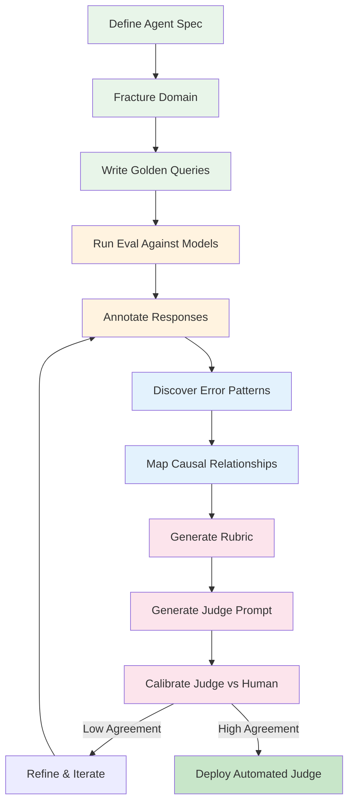
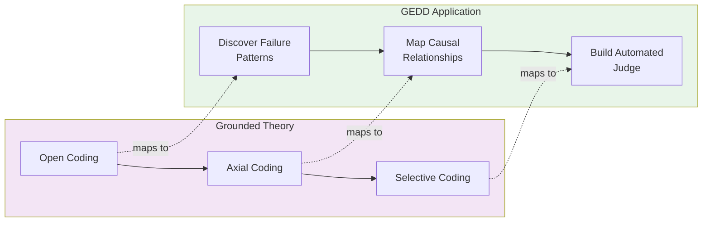
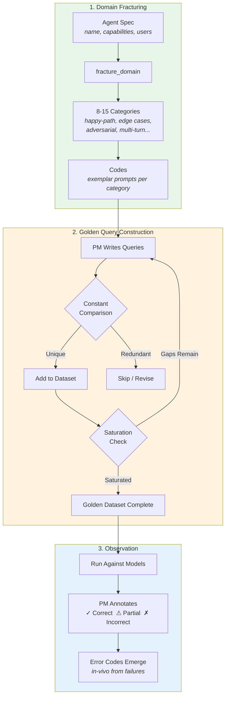
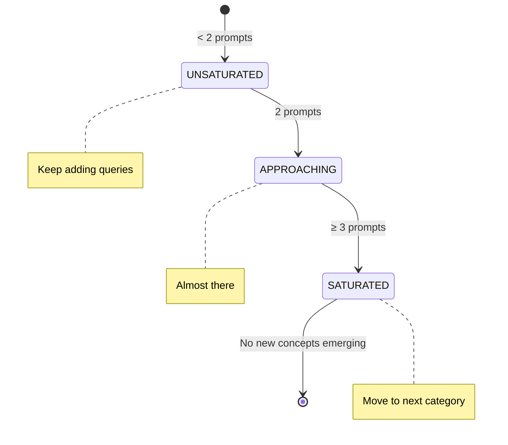
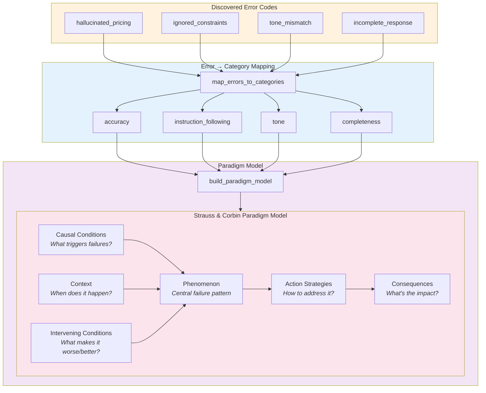
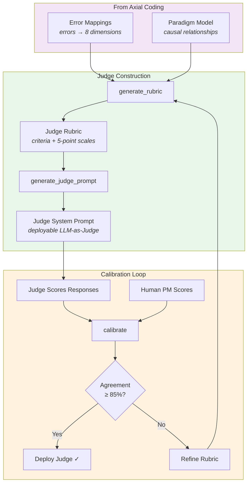
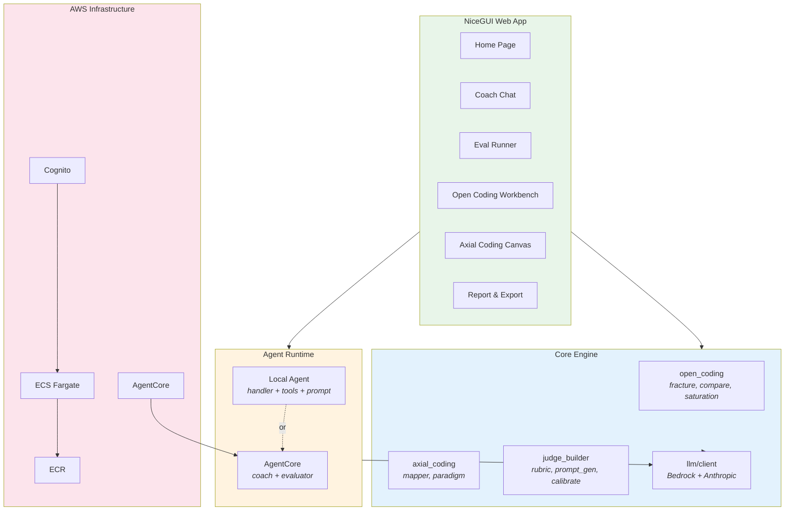

# GEDD — Grounded Eval-Driven Development

**Build LLM evaluation judges grounded in real observed failures, not assumptions.**

GEDD applies [Grounded Theory](https://en.wikipedia.org/wiki/Grounded_theory) — a rigorous qualitative research methodology — to the problem of evaluating AI agents. Instead of inventing rubrics from guesses about what might go wrong, you discover evaluation criteria inductively from what *actually* goes wrong.

---

## The Problem

Traditional LLM evaluation starts with assumed rubrics: "check for helpfulness, accuracy, safety." But how do you know those are the right criteria for *your* agent? How do you weight them? What failure modes are you missing?

GEDD flips this: **observe first, theorize second.**

---

## How It Works — The GEDD Pipeline



---

## Qualitative Research Methodology

GEDD maps three phases of Grounded Theory to LLM evaluation:



| Grounded Theory Concept | GEDD Implementation |
|---|---|
| **Open Coding** — fracturing data into concepts | Break agent domain into testable categories, discover error codes |
| **Constant Comparison** — comparing each datum to existing | Each new query compared against existing set for uniqueness |
| **Theoretical Saturation** — stop when no new concepts emerge | Stop adding queries when categories are fully covered |
| **Axial Coding** — relating categories via Paradigm Model | Map errors to causal conditions, context, consequences |
| **Selective Coding** — identifying core category | Central failure phenomenon becomes primary eval criterion |
| **Memos** — researcher's documented rationale | PM documents reasoning behind each annotation |

---

## Phase 1: Open Coding

Open Coding is the inductive discovery phase. You break the agent's domain into testable pieces, then observe what actually happens.



### Key Concepts

- **In Vivo Codes** — Named in the PM's own words from observed failures (e.g., "hallucinated pricing")
- **Constructed Codes** — AI-suggested labels for patterns (e.g., "context_window_overflow")
- **Properties & Dimensions** — Each category varies along axes (complexity: low↔high, tone: casual↔formal)
- **Saturation** — A category is saturated when ≥3 prompts cover it and no new patterns emerge

### Saturation Model



---

## Phase 2: Axial Coding

Axial Coding connects the error patterns you discovered into a causal model. It answers: *why* do failures happen?



### The 8 Standard Evaluation Dimensions

Errors are mapped to these categories:

| Dimension | What It Measures |
|---|---|
| **Quality** | Overall response quality and coherence |
| **Accuracy** | Factual correctness, no hallucinations |
| **Brand Relevance** | Alignment with brand voice and guidelines |
| **Bias** | Fairness, no discriminatory patterns |
| **Safety** | No harmful, dangerous, or inappropriate content |
| **Completeness** | All parts of the query addressed |
| **Tone** | Appropriate register and style |
| **Instruction Following** | Adherence to constraints and directives |

---

## Phase 3: Judge Builder (Selective Coding)

The final phase transforms your qualitative analysis into a deployable automated judge.



### Generated Rubric Structure

Each criterion gets a 5-point scoring scale grounded in observed failures:

```
5 — Excellent: No issues observed
4 — Good: Minor issues, acceptable
3 — Adequate: Some issues, borderline
2 — Poor: Significant issues matching observed error patterns
1 — Failing: Critical failures (e.g., hallucinated_pricing, ignored_constraints)
```

The judge outputs structured JSON:
```json
{
  "scores": {"accuracy": 4, "completeness": 3, "tone": 5},
  "justifications": {"accuracy": "Minor imprecision in...", ...},
  "overall_score": 4.0,
  "pass": true,
  "summary": "Response meets criteria with minor accuracy gap."
}
```

---

## Architecture



---

## Quick Start

```bash
cd grounded-evals

# Create virtual environment
python -m venv .venv
source .venv/bin/activate

# Install in development mode
pip install -e ".[dev]"

# Run the app
python -m grounded_evals.app
```

The app runs at `http://localhost:8080`.

### Environment Variables

| Variable | Purpose | Default |
|---|---|---|
| `HOST` | Server bind address | `0.0.0.0` |
| `PORT` | Server port | `8080` |
| `AWS_REGION` | Bedrock region | `us-west-2` |
| `ANTHROPIC_MODEL` | Default model | `claude-haiku-4-5-20250315` |
| `AGENTCORE_AGENT_ID` | Remote agent ID (optional) | — |
| `ADMIN_PASSWORD` | Fallback auth password | — |
| `LANGSMITH_API_KEY` | Tracing (optional) | — |

---

## Project Structure

```
grounded-evals/
├── src/grounded_evals/
│   ├── open_coding/        # Phase 1: Discover patterns
│   │   ├── fracture.py     #   Domain → categories + codes
│   │   ├── compare.py      #   Constant comparison method
│   │   └── saturation.py   #   Theoretical saturation checks
│   ├── axial_coding/       # Phase 2: Relate patterns
│   │   ├── mapper.py       #   Errors → 8 standard dimensions
│   │   └── paradigm.py     #   Build Paradigm Model
│   ├── judge_builder/      # Phase 3: Build judge
│   │   ├── rubric.py       #   Generate scoring rubric
│   │   ├── prompt_gen.py   #   Generate judge system prompt
│   │   └── calibrate.py    #   Human vs judge agreement
│   ├── agent/              # Conversational coach
│   │   ├── handler.py      #   Tool-use loop
│   │   ├── tools.py        #   6 coaching tools
│   │   └── prompt.py       #   Coach system prompt
│   ├── ingest/             # Input parsing
│   │   ├── parser.py       #   YAML agent spec parser
│   │   └── models.py       #   AgentSpec, Capability, Persona
│   ├── models/core.py      # All data models (Pydantic)
│   ├── ui/                 # NiceGUI pages
│   └── app.py              # App entry point
├── agentcore/              # AWS AgentCore runtime
├── infra/                  # CDK infrastructure
├── configs/                # Example YAML specs
└── tests/
```

---

## Deployment

Infrastructure is defined with AWS CDK:

```bash
cd infra
pip install -r requirements.txt
cdk deploy --all
```

Stacks: Network (VPC) → ECR → ECS Fargate (UI) → Cognito (auth) → AgentCore (agent runtime)

---

## Why Grounded Theory?

Most eval frameworks ask: "What should we measure?" — then build rubrics from assumptions.

Grounded Theory asks: "What is actually happening?" — then builds theory from evidence.

This matters because:
1. **You can't evaluate what you haven't observed** — Assumed rubrics miss failure modes unique to your agent
2. **Criteria should be weighted by evidence** — Not all dimensions matter equally for every agent
3. **Evaluation evolves** — As your agent improves, new failure patterns emerge; the methodology handles this naturally
4. **Calibration proves validity** — If your judge agrees with human annotators ≥85% of the time, your grounded criteria are working

---

## Security

See [CONTRIBUTING](CONTRIBUTING.md#security-issue-notifications) for more information.

## License

This library is licensed under the MIT-0 License. See the LICENSE file.
