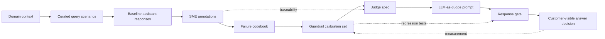
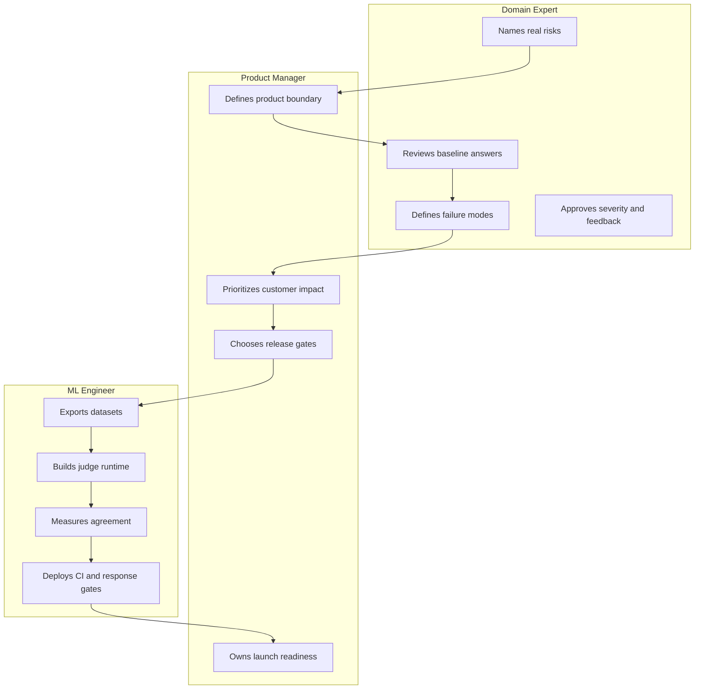
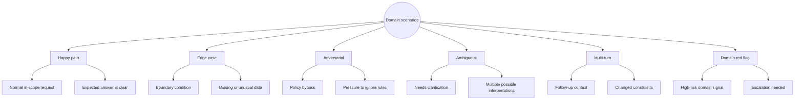
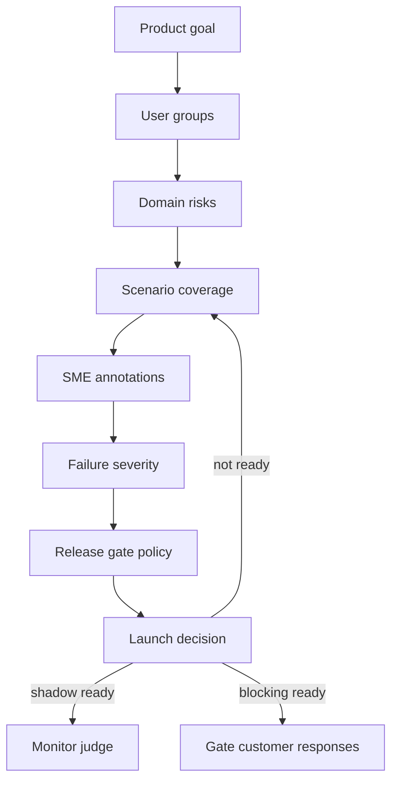
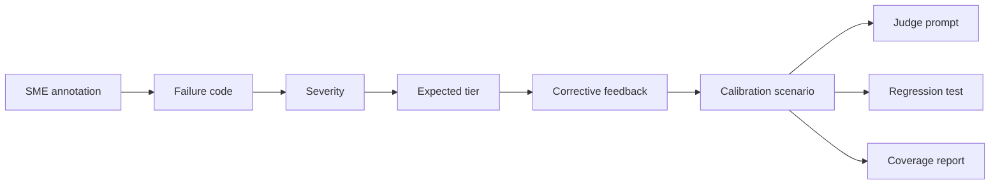
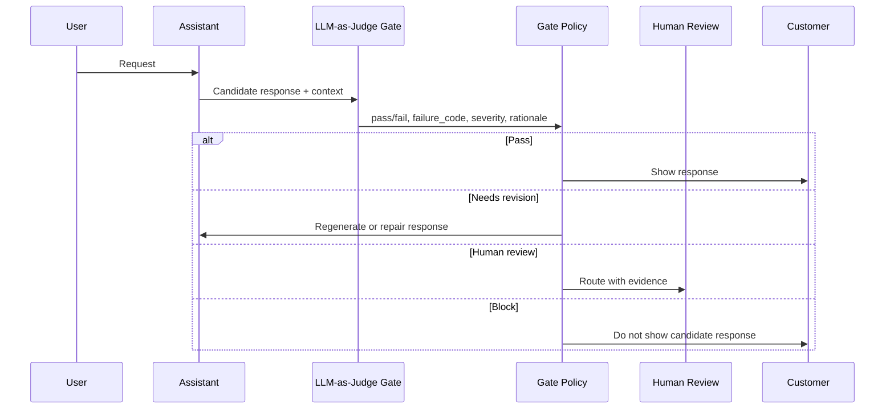
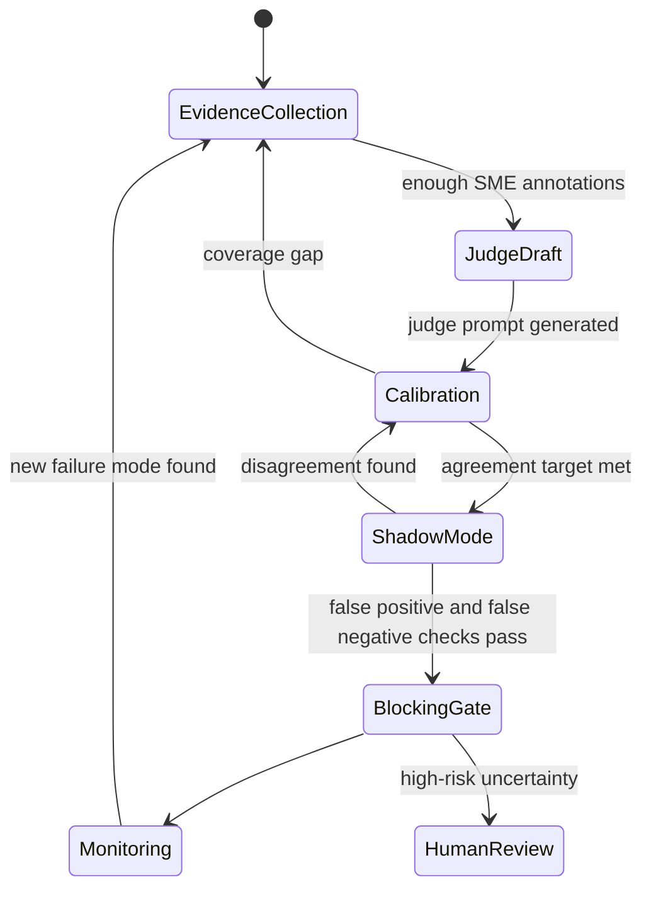
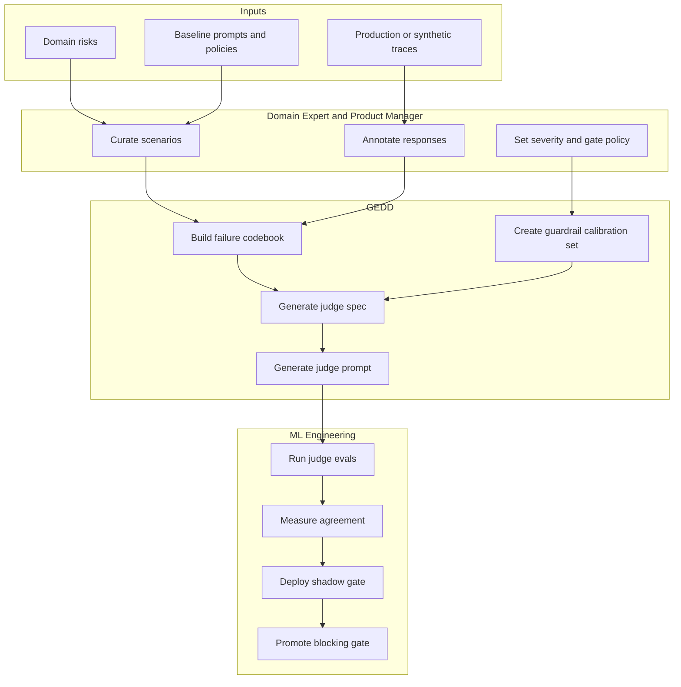
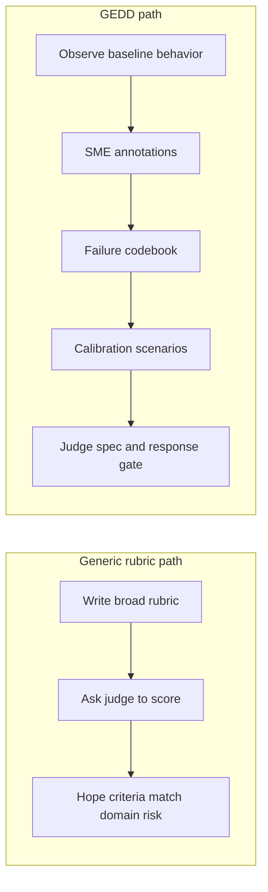

# What Is GEDD? A Shared Explanation for Domain Experts, Product Managers, and ML Engineers

GEDD means Grounded Evidence Driven Development.

It is a workflow for turning expert judgment into a systematic LLM-as-Judge response gate. The gate checks candidate customer-facing responses before customers see them.

GEDD exists because AI quality is not just a model problem. In most real domains, the hardest part is knowing what "good" means. A generic evaluator can say whether an answer is fluent, but it cannot reliably know whether an answer is acceptable for pharmacy, insurance, tax, legal, localization, financial services, education, healthcare operations, or any other specialist domain.

GEDD puts the people who know the domain at the center of the evaluation process. Domain experts and product managers curate evidence. ML engineers turn that evidence into repeatable tests, calibrated judges, and release gates.

The short version:

```text
GEDD converts SME evidence into guardrail calibration scenarios,
then uses those scenarios to build and measure a domain-specific LLM-as-Judge.
```

## The Core Idea

Most teams try to write an AI rubric too early. They start with abstract criteria like "be accurate," "be helpful," or "follow policy." Those are useful intentions, but they are not enough to gate a real product.

GEDD starts with observed behavior:

1. Define the domain and risk boundaries.
2. Curate scenarios that expose those boundaries.
3. Run the baseline assistant.
4. Ask SMEs to judge the responses.
5. Convert SME judgments into failure codes and calibration scenarios.
6. Generate a judge spec and LLM-as-Judge prompt.
7. Run the judge as a response gate.
8. Measure the judge before it becomes a blocking control.



The output is not just a document. It is a chain of evidence that explains why a response should pass, fail, block, or go to human review.

## What GEDD Produces

GEDD produces artifacts that each role can use.

| Artifact | What it answers |
|---|---|
| Domain profile | What domain are we evaluating, who uses the assistant, and what risks matter? |
| Curated query set | Which user scenarios should the assistant handle or reject? |
| Baseline response evidence | What does the current assistant actually do? |
| SME annotations | Which responses are correct, partial, incorrect, unsafe, incomplete, or off-policy? |
| Failure codebook | What repeatable failure modes did SMEs discover? |
| Guardrail calibration set | Which scenarios calibrate input guardrails, output guardrails, and response gates? |
| Judge spec | What must the LLM-as-Judge detect, block, escalate, and explain? |
| Judge prompt | How should the judge evaluate a candidate response? |
| Response gate | What structured decision is returned before customers see the answer? |
| Measurement report | Is the judge specific, testable, traceable, calibrated, and covered? |

## How the Three Roles See GEDD

GEDD is one workflow, but each role experiences it differently.



## For a Domain Expert

For a domain expert, GEDD is a way to transfer your judgment into the AI system without asking you to become an ML engineer.

You do not need to write model code. You do not need to tune prompts. Your job is to say what a good answer looks like in your domain, what a dangerous answer looks like, and where the assistant must slow down or escalate.

GEDD asks you to help with five things.

### 1. Define the Domain

The first question is not "what model are we using?" It is:

```text
What domain are you the expert in, and what can go wrong if the assistant answers badly?
```

Examples:

- A pharmacist may care about dose-unit confusion, contraindication handling, and escalation to prescriber review.
- An insurance claims SME may care about bad-faith denial, invented coverage status, and state-specific regulation misses.
- A localization lead may care about runtime tokens, rating-board language, regional compliance, and canon terminology.
- A compliance specialist may care about legal basis, retention, data minimization, incident response, and cross-border transfer claims.

GEDD captures this as domain context.

### 2. Curate Scenarios

GEDD helps you create scenarios that expose domain boundaries.

The goal is not to create a random list of prompts. The goal is to cover the domain.

Useful scenario categories include:

- Happy path
- Edge case
- Adversarial request
- Ambiguous request
- Multi-turn request
- Error recovery
- Persona or permission variation
- Domain red flag



### 3. Review Baseline Answers

GEDD then tests the current assistant against those scenarios.

You review the answer and label it:

- Correct
- Partial
- Incorrect
- Needs human review

The most valuable part is the reason. GEDD asks what you see that a generic evaluator would miss.

### 4. Name the Failure

When a response is wrong, GEDD helps turn your judgment into a repeatable failure code.

Examples:

- `dose_unit_confusion`
- `coverage_hallucination`
- `placeholder_and_markup_corruption`
- `rating_or_disclosure_softening`
- `legal_basis_overclaim`
- `missing_escalation_for_high_risk_case`

The exact code name matters because the judge later uses it as a structured label.

### 5. Approve the Gate Behavior

Finally, you help decide what should happen when a failure appears:

- Allow the response
- Ask for revision
- Show resources and continue
- Block the response
- Escalate to human review

That decision becomes part of the guardrail calibration set.

For a domain expert, the promise is simple:

```text
Your judgment becomes executable quality control.
```

## For a Product Manager

For a product manager, GEDD is a release-quality workflow.

It helps you answer:

- What are the product risks?
- Which failures are release blockers?
- Which failures are tolerable, fix-forward issues?
- Is the judge grounded in actual SME evidence?
- Can engineering measure the gate before launch?

GEDD turns the vague question "is the AI good enough?" into a product decision:

```text
Which customer-visible responses are allowed, blocked, revised, or escalated?
```

### The PM Owns the Quality Bar

Product managers do not need to personally label every example, but they do need to own the product threshold.

GEDD gives PMs a structured way to set that threshold.



### Product Questions GEDD Answers

| PM question | GEDD evidence |
|---|---|
| What can go wrong? | Domain risks, red-flag scenarios, failure codebook |
| How often did it go wrong in our test set? | Baseline response annotations |
| Which failures block launch? | Severity and response-gate policy |
| Are we covering the right scenarios? | Category coverage and saturation |
| Can we explain the gate to stakeholders? | Traceability from scenario to annotation to judge criterion |
| Is the judge ready to block traffic? | Judge-human agreement, false positive checks, false negative checks |

### The PM Handoff

The PM can use GEDD outputs in planning and launch reviews:

- Prioritized failure modes
- Release-blocking scenarios
- Evidence-backed judge criteria
- Measurement targets
- Engineering implementation queue
- Customer-visible risk summary

The PM does not need to argue from opinion. They can point to a scenario, an SME annotation, a failure code, and a gate decision.

For a product manager, the promise is:

```text
You get a defensible release gate built from expert evidence.
```

## For an ML Engineer

For an ML engineer, GEDD is a data and evaluation pipeline.

It gives you labeled, traceable, domain-specific artifacts that can become:

- Judge prompts
- Regression datasets
- CI checks
- Shadow-mode monitors
- Blocking response gates
- Human-review routing rules

### The ML Engineer Needs Structure

An ML engineer cannot safely automate vague stakeholder feedback like "make it more compliant" or "sound more accurate."

GEDD converts that feedback into structured data:



### What the Engineer Builds

The engineer takes GEDD outputs and builds the operational path.



### The Judge Output Contract

GEDD expects structured judge output. A typical contract looks like this:

```json
{
  "pass_fail": "pass | fail",
  "failure_code": "domain failure label or null",
  "severity": "low | medium | high | critical | catastrophic",
  "rationale": "why the response passes or fails",
  "evidence_references": ["query id", "failure code", "judge criterion"],
  "recommended_action": "allow | revise_response | request_human_review",
  "customer_visible_block": true
}
```

The engineer can enforce schema validity, exact failure-code names, and decision-routing behavior.

### Promotion Stages

The judge should not become a blocking production gate on day one.

GEDD supports a staged path:



Useful promotion checks include:

- Judge-human agreement on labeled examples
- False positives on clean pass examples
- False negatives on critical fail examples
- Valid structured output
- Exact codebook label use
- Category coverage
- Drift monitoring after model or prompt changes

For an ML engineer, the promise is:

```text
You get domain-labeled calibration data and a traceable gate contract,
not a vague product request.
```

## The Shared Operating Model

GEDD works because it gives each role a clear responsibility.



## RACI View

| Activity | Domain expert | Product manager | ML engineer |
|---|---|---|---|
| Define domain risks | Responsible | Accountable | Consulted |
| Curate scenarios | Responsible | Accountable | Consulted |
| Review baseline responses | Responsible | Consulted | Informed |
| Name failure modes | Responsible | Consulted | Informed |
| Set severity and launch priority | Consulted | Accountable | Consulted |
| Build judge spec | Consulted | Accountable | Responsible |
| Implement judge runtime | Informed | Consulted | Responsible |
| Measure judge-human agreement | Consulted | Accountable | Responsible |
| Promote to blocking gate | Consulted | Accountable | Responsible |
| Monitor drift and new failures | Consulted | Accountable | Responsible |

## A Concrete Example

Imagine an AAA game localization assistant.

A generic evaluator might reward an answer because it is fluent and confident. A localization SME may reject the same answer because it approves a translated string that drops a runtime placeholder.

GEDD captures that as evidence:

| Evidence field | Example |
|---|---|
| Scenario | A localized subtitle dropped `{player_name}` but still reads naturally |
| Baseline answer | The assistant says it is acceptable because the meaning is mostly preserved |
| SME verdict | Incorrect |
| Failure code | `placeholder_and_markup_corruption` |
| Severity | Catastrophic |
| Reason | Runtime variables are required; losing them can break UI or dialogue state |
| Corrective feedback | Block release until the placeholder is preserved and tested in context |
| Gate action | Block customer-visible approval |

The judge gate can now detect this pattern later.

It does not merely ask, "Is this translation fluent?"

It asks, "Does this response approve a localization defect that violates runtime, lore, rating, regional, or release-safety evidence?"

## Why This Is Different From a Generic Rubric

A generic rubric starts with criteria.

GEDD starts with evidence.



The difference matters because many dangerous AI responses are fluent, polished, and superficially helpful. GEDD is designed to catch responses that are unacceptable because of domain-specific evidence.

## What Good Looks Like

A mature GEDD implementation has:

- A domain profile with explicit users, risks, boundaries, and known edge cases
- A scenario set covering happy paths, edge cases, adversarial pressure, ambiguity, multi-turn context, recovery, persona variation, and red flags
- Baseline response traces
- SME annotations with severity and rationale
- A failure codebook with exact labels
- Guardrail calibration scenarios with expected tiers and feedback
- A judge spec with traceability to evidence
- A judge prompt with structured output
- Measurement for agreement, false positives, false negatives, and schema validity
- A response gate that can run in shadow mode before it blocks

## The One-Sentence Explanation

For a domain expert:

```text
GEDD turns your judgment into executable quality gates.
```

For a product manager:

```text
GEDD turns product risk into a defensible release decision.
```

For an ML engineer:

```text
GEDD turns SME annotations into calibration data, judge prompts, and deployable response gates.
```

For the whole team:

```text
GEDD is the evidence pipeline between expert judgment and automated LLM-as-Judge control.
```
