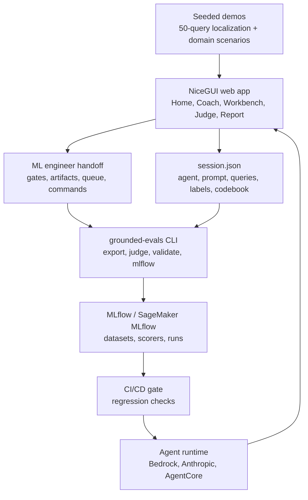

# GEDD - A Systematic Evidence Driven LLM As a Judge Framework

[](https://github.com/aws-samples/sample-GEDD/actions/workflows/ci.yml)
[](https://www.python.org/downloads/)
[](LICENSE)
[](https://github.com/aws-samples/sample-GEDD/stargazers)

GEDD is a Systematic Evidence Driven LLM As a Judge Framework for AI agents.

It is an annotation-first workflow for turning domain-owner review of AI agent behavior into release gates engineering can run.

The web app gives product managers, domain experts, and ML engineers one shared path:

1. Define the agent and the work it is supposed to do.
2. Collect or load representative queries and responses.
3. Review the responses in a task-shaped workbench.
4. Name failures in the domain owner's vocabulary.
5. Convert the observed failures into an LLM-as-a-judge prompt.
6. Export a validated handoff for CI, MLflow, and model regression work.

The current first-run experience ships with two 50-query PM workbench demos: an AAA game localization session and an AWS cloud GDPR auditor session. They show how a domain owner can move from raw agent traces to open codes, root-cause patterns, saturation evidence, a judge prompt, and an ML engineer implementation queue.


The longer methodology essay is in [METHODOLOGY.md](METHODOLOGY.md). This README is the practical product and engineering guide.

## What GEDD Produces

| Output | Who creates it | Who uses it | Why it matters |
|---|---|---|---|
| Golden queries | PM or domain expert | ML engineer, eval owner | Defines the user situations the agent must handle |
| Human labels | PM or domain expert | Judge builder, release owner | Separates acceptable, partial, and failing behavior |
| Failure codebook | PM or domain expert | ML engineer, prompt owner | Names the exact domain-specific failure modes to fix |
| Memos and severity | PM or domain expert | ML engineer, reviewer | Explains why the failure matters and how bad it is |
| Axial coding | PM or domain expert | Product and engineering leads | Groups repeated failures into root causes and consequences |
| Judge prompt | PM plus ML engineer | CI and model evaluation | Converts observed failures into automated review criteria |
| `session.json` handoff | App or CLI | ML engineer | Carries agent spec, prompt, queries, labels, and validation state |
| MLflow artifacts | ML engineer | Release pipeline | Tracks datasets, judges, evaluation runs, and regression gates |

GEDD is not a generic model leaderboard. It is a way to preserve expert judgment and make it executable.

## Quick Start

Start the web app:

```bash
cd grounded-evals
python -m venv .venv
source .venv/bin/activate
pip install -e ".[dev]"
grounded-evals serve --host 127.0.0.1 --port 8080
```

Open `http://127.0.0.1:8080`.

No Codex skill or plugin is required.

Local runs start in guest mode unless `ADMIN_PASSWORD` or Cognito environment variables are configured. If port `8080` is busy, use `--port 8081`.

For the fastest product tour, use one of the seeded 50-query demos. They do not require model calls:

1. Open `Home` or `Demos`.
2. Click `Load 50-query localization demo` or `Load 50-query AWS Cloud GDPR demo`.
3. Open `PM Workbench` to review the labeled traces, failure codes, memos, and saturation state.
4. Open `Judge` to inspect or revise the generated judge prompt.
5. Open `Report` to review release readiness and download the ML engineer handoff.

To reset after loading a demo, use the top-right refresh action. Confirm `Start Fresh` to clear the loaded project data while keeping the current login session.

## Current Web App

`grounded-evals serve` runs a NiceGUI app with a short primary navigation:

| Page | Purpose | Main actions |
|---|---|---|
| `Home` | Entry point | Load the 50-query localization or AWS Cloud GDPR demo, continue active work, or start a custom agent |
| `AI PM Coach` | Guided setup | Capture agent definition, system prompt, runtime choice, and golden-query plan |
| `PM Workbench` | Annotation surface | Review responses, assign verdicts, create failure codes, set severity, write memos, and monitor saturation |
| `Judge` | Release gate builder | Generate and edit an LLM-as-a-judge prompt from the observed failure modes |
| `Report` | Engineering handoff | Review quality signals, CI gates, artifact readiness, implementation queue, and export files |

The Demos page remains available for starter data. It is not the main workflow. Demos are seed sessions that help teams understand the annotation loop before they bring their own traces.

## The 50-Query Localization Demo

The main demo is a synthetic but complete localization QA session for an AAA game agent called `LocaleGate`.

It includes:

| Asset | Contents |
|---|---|
| 50 golden queries | Runtime strings, storefront copy, subtitles, RTL input prompts, region rules, culturalization, paid-currency copy, live-event dates, and glossary consistency |
| Synthetic responses | Baseline agent answers with realistic localization failures |
| PM annotations | Correct, partial, and incorrect verdicts with severity and confidence |
| Open codes | Localization-specific failure labels rather than generic quality tags |
| Axial coding | Root causes, context, intervening conditions, action strategy, and consequence mapping |
| Saturation evidence | Final-window evidence that new annotations repeat existing codes |
| Judge prompt | A release-gate judge built from the localization failure modes |
| Report handoff | CI gates, artifact status, implementation queue, and commands for an ML engineer |

Example failure codes in the demo include:

| Code | What it catches |
|---|---|
| Placeholder And Markup Corruption | The response approves a translation that drops variables, tags, markup, or runtime-safe formatting |
| Gameplay Meaning Reversal | The localized text reverses the gameplay instruction or player action |
| Rating Or Disclosure Softening | Marketing or regional copy weakens required rating, privacy, paid-currency, or platform disclosures |
| RTL Input Direction Drift | Right-to-left layout or controller input language changes the intended interaction |
| Locale Format Ambiguity | Dates, times, numbers, or currencies remain ambiguous for the target locale |
| Entitlement Copy Mistranslation | Storefront text changes what the buyer receives or what content is included |
| Culturalization Risk Dismissal | The response treats regional content risk as a translation-only issue |

Those labels are the point of the workflow. The judge is not asked to score generic helpfulness first. It is asked to enforce the domain owner's observed release blockers.

## The 50-Query AWS Cloud GDPR Demo

The second main workbench demo is a synthetic AWS cloud GDPR audit session for `CloudAuditGate`.

It includes 50 golden queries covering S3 and CloudWatch retention, CloudTrail and centralized logging, Bedrock prompt reuse, Rekognition and high-risk review, DSAR and deletion handling across backups and data lakes, shared responsibility, cross-region transfers, and breach escalation from AWS security incidents. The output is the same PM-owned package as the localization demo: annotations, open codes, axial coding, saturation evidence, and an audit-ready judge prompt.

The AWS Cloud GDPR demo uses plain-language tags on purpose, for example `Data Used For The Wrong Job`, `Collecting Or Keeping Too Much Data`, `EU Data Moved The Wrong Way`, and `Trying To Work Around GDPR`. The point is to make the GEDD loop easy to follow: annotate the failure in human language first, then turn that observed pattern into the judge gate.

## Bring Your Own Agent

Use the app when you have a real or proposed agent and need review evidence before you automate evaluation.

| Step | What to do | Output |
|---|---|---|
| 1. Define | Describe the agent, user, task boundary, and system prompt in `AI PM Coach` | Agent spec and prompt |
| 2. Build queries | Generate or paste golden queries that cover normal, edge, ambiguous, adversarial, multi-turn, and recovery cases | Query set |
| 3. Get responses | Run the saved prompt against Bedrock, Anthropic, or a configured runtime, or paste existing traces | Response queue |
| 4. Annotate | Review each response in `PM Workbench` and capture verdict, code, severity, confidence, and memo | Human labels and codebook |
| 5. Pattern | Use open coding and axial coding to group repeated failures and root causes | Release-risk model |
| 6. Judge | Build the judge prompt from the observed codes and examples | LLM-as-a-judge prompt |
| 7. Handoff | Export the session and ML handoff from `Report` | Engineering package |

If you already have production traces, use the app as an annotation surface rather than generating new responses. See [Paste In Traces](grounded-evals/docs/paste-in-traces.md).

## ML Engineer Handoff

The Report page contains an `ML Engineer Handoff` section. It is designed to be actionable, not a narrative status update.

It gives engineering:

| Handoff field | Why it exists |
|---|---|
| Engineering status | Indicates whether the session is blocked by P0 failures, missing a judge, needs calibration, or is ready for a CI pilot |
| CI gates | Shows current and target values for P0 failures, regression pass rate, human coverage, and judge-human agreement |
| Artifact status | Confirms whether session handoff, golden dataset, codebook, judge prompt, and calibration evidence are ready |
| Implementation queue | Prioritizes failure codes by severity and count, with tagged examples and definitions of done |
| Runbook | Gives commands the ML engineer can run immediately |

Typical handoff commands:

```bash
cd grounded-evals

grounded-evals validate-session --session session.json
grounded-evals export --session session.json --format jsonl --output golden_dataset.jsonl
grounded-evals judge --session session.json --output judge_prompt.md
grounded-evals mlflow --session session.json --tracking-uri $MLFLOW_TRACKING_URI --run-eval
```

The expected engineering loop is:

1. Validate the session.
2. Create one failing regression case for each P0 queue item.
3. Patch the prompt, retrieval policy, tool policy, or runtime behavior.
4. Rerun the judge and review disagreements.
5. Promote the gate only after calibration is acceptable.

The default calibration target used in the handoff is `kappa >= 0.80` before the judge blocks merges.

## CLI Reference

The CLI supports the same workflow for repeatable runs, scripting, and CI.

| Command | Use |
|---|---|
| `grounded-evals serve` | Start the web app |
| `grounded-evals chat` | Run the guided PM workflow from the terminal |
| `grounded-evals eval` | Run golden queries against supported models |
| `grounded-evals annotate` | Add verdicts and failure codes from the terminal |
| `grounded-evals analyze` | Map failure codes into legacy evaluation dimensions when needed |
| `grounded-evals fracture` | Break a domain into coverage categories and candidate queries |
| `grounded-evals compare` | Check whether a new query adds unique coverage |
| `grounded-evals check-saturation` | Check whether the dataset is still producing new concepts |
| `grounded-evals coverage` | Show coverage by category |
| `grounded-evals judge` | Generate a judge prompt from the session |
| `grounded-evals validate-session` | Check whether a session is ready for handoff |
| `grounded-evals handoff` | Write a validated session handoff artifact |
| `grounded-evals export` | Export the golden dataset as JSON, JSONL, or CSV |
| `grounded-evals mlflow` | Create MLflow or SageMaker MLflow artifacts and optionally run evals |
| `grounded-evals status` | Print a session summary |

Run command help from the package directory:

```bash
cd grounded-evals
grounded-evals --help
grounded-evals mlflow --help
```

## Web App And CLI

GEDD ships as a web app and a CLI. No Codex skill or plugin is required.

| Interface | Entry point | Use |
|---|---|---|
| Web app | `grounded-evals serve` | Primary workflow for demos, PM annotation, judge building, and report export |
| CLI | `grounded-evals --help` | Repeatable validation, exports, automation, and MLflow runs |

Use the web app first unless you are automating an established workflow. The CLI is the right path for CI, MLflow, scripted exports, and headless checks.

## Runtime And Provider Configuration

Local demo review does not require an LLM provider because the main localization demo is preloaded.

For custom agent work, configure one provider:

| Provider | Configuration |
|---|---|
| Amazon Bedrock | Configure AWS credentials and set `AWS_REGION`; optionally set `BEDROCK_MODEL_ID` |
| Anthropic API | Set `ANTHROPIC_API_KEY`; direct Anthropic calls take priority when the key is present |
| AgentCore runtime | Configure the AgentCore environment variables used by your deployment |

See [SETUP.md](SETUP.md) for a full environment variable list, Bedrock model access notes, auth options, and AWS deployment setup.

## Architecture



Core paths:

| Path | Responsibility |
|---|---|
| `grounded-evals/src/grounded_evals/app.py` | App entry point, health endpoint, release marker |
| `grounded-evals/src/grounded_evals/ui/` | NiceGUI pages, layout, demos, workbench, judge, report |
| `grounded-evals/src/grounded_evals/open_coding/` | Domain fracturing, query comparison, saturation checks |
| `grounded-evals/src/grounded_evals/axial_coding/` | Root-cause and paradigm-model mapping |
| `grounded-evals/src/grounded_evals/judge_builder/` | Rubric, prompt generation, calibration, judge variants |
| `grounded-evals/src/grounded_evals/guide/` | Session persistence and handoff validation |
| `grounded-evals/src/grounded_evals/cli.py` | Command-line workflow |
| `grounded-evals/infra/` | AWS CDK infrastructure |
| `grounded-evals/Dockerfile` | Container image for the web app |

## Validation

Before committing app or workflow changes:

```bash
cd grounded-evals
PYTHONPATH=src pytest
PYTHONPATH=src python3 -m grounded_evals.cli --help
```

For local web smoke tests:

```bash
grounded-evals serve --host 127.0.0.1 --port 8080

for p in / /coding /demos /coach /judge /report /health; do
  curl -sS -o /dev/null -w "$p %{http_code}\n" "http://127.0.0.1:8080$p"
done
```

For README-only changes, `git diff --check` and stale-message scans are usually enough.

## Additional Docs

| Doc | Use |
|---|---|
| [SETUP.md](SETUP.md) | Local setup, provider configuration, auth, troubleshooting, deployment |
| [METHODOLOGY.md](METHODOLOGY.md) | Grounded-theory method behind the workflow |
| [Pipeline Guide](grounded-evals/docs/pipeline-guide.md) | End-to-end workflow and CI/CD shape |
| [Domain Expert Guide](grounded-evals/docs/domain-expert-guide.md) | PM and SME review walkthrough |
| [PM To ML LLM Judge](grounded-evals/docs/pm-to-ml-llm-judge.md) | Turning annotated sessions into production judges |
| [Building An LLM Judge](grounded-evals/docs/building-llm-as-a-judge.md) | Judge design and calibration details |
| [Cohen's Kappa](grounded-evals/docs/cohens-kappa-for-llm-judges.md) | Judge-human agreement guidance |
| [Launch Checklist](grounded-evals/docs/launch-checklist.md) | Release readiness checks |

## License And Security

License: MIT-0. See [LICENSE](LICENSE).

Security issue reporting: see [CONTRIBUTING.md](CONTRIBUTING.md#security-issue-notifications).
