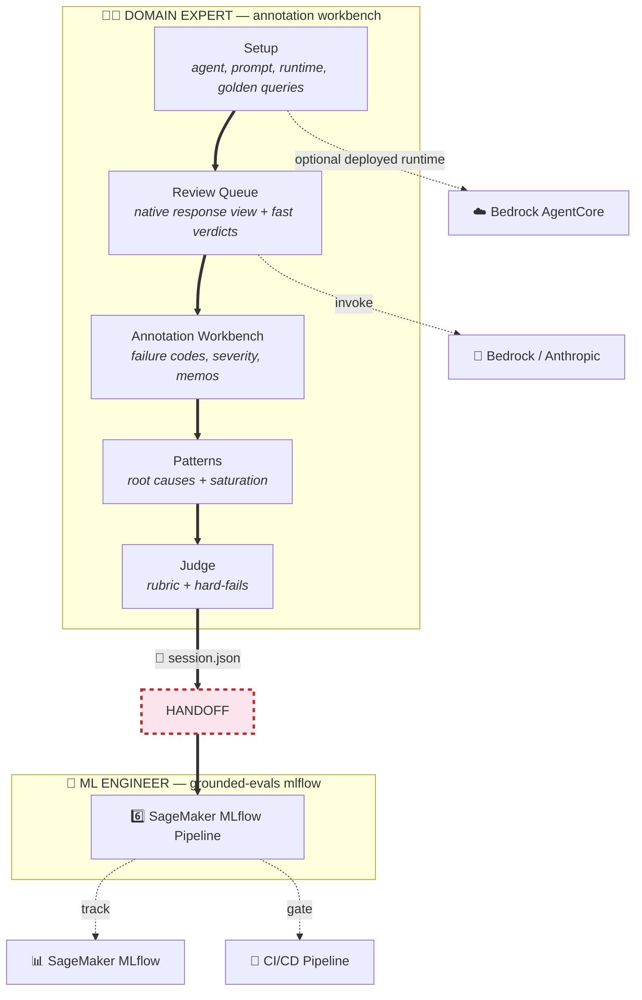
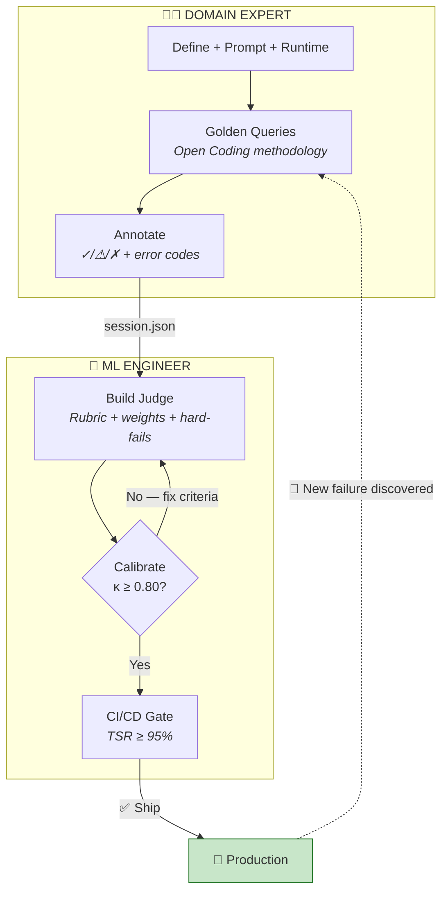
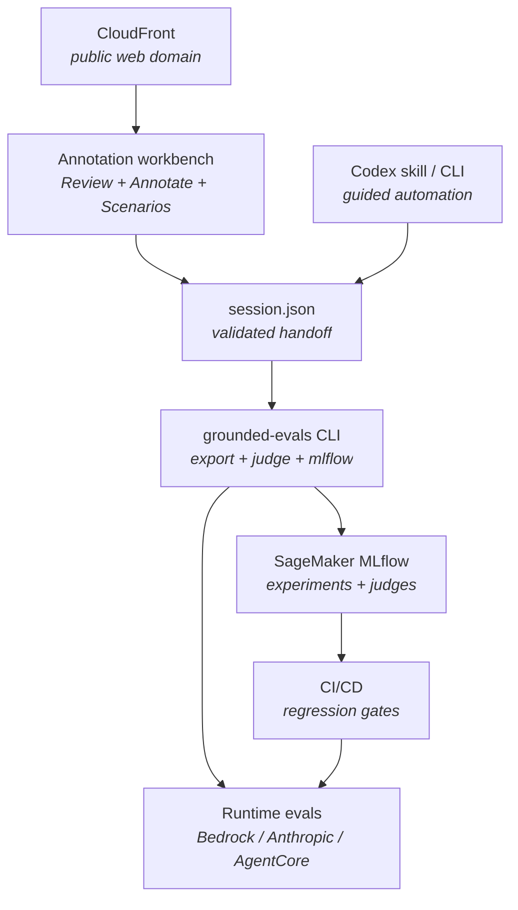

# GEDD — Grounded Eval-Driven Development for AI Agents

[](https://github.com/aws-samples/sample-GEDD/actions/workflows/ci.yml)
[](https://www.python.org/downloads/)
[](LICENSE)
[](https://github.com/aws-samples/sample-GEDD/stargazers)

You shipped an AI agent. Now you need to prove it works — to your CEO, to compliance, and to the team that inherits it. The agent fails in ways no rubric anticipated, while most eval tools expect reviewers to score raw traces, generic tables, or dashboards that were not built for their domain.

**GEDD is an annotation workbench for *before* you have a rubric.** A product manager or domain expert reviews agent behavior in context, applies fast first-pass verdicts, names failure modes in their own vocabulary, and hands engineering a validated `session.json` that can become an automated judge and CI gate.

> *The annotation workbench is the product. Judges, reports, and CI gates are downstream of label quality.*


📖 [Why Grounded Theory? for reliable AI Agents](https://balachanderkeelapudi.substack.com/p/why-grounded-theory-for-reliable) — the long-form argument behind this repo.

---

## What GEDD Builds

GEDD turns high-quality human annotation into production evaluation assets:

| Artifact | Created by | Why it matters |
|----------|------------|----------------|
| Annotation workbench | Domain expert review | Native review surface for queries, responses, verdicts, failure codes, severity, confidence, memos, filters, hotkeys, and progress |
| `session.json` | Workbench handoff | Canonical handoff: agent spec, system prompt, golden queries, annotations, prompt variants, and chat history |
| Golden dataset | Open Coding | Queries that cover happy paths, edge cases, adversarial inputs, ambiguity, and multi-turn behavior |
| Failure codebook | Human annotation | Domain-specific failure vocabulary such as `dosage_unit_confusion`, not generic "bad answer" labels |
| Paradigm model | Axial Coding | Causal map of triggers, contexts, amplifiers, observed behavior, and user impact |
| Judge prompt | Selective Coding | G-Eval rubric with weighted criteria and hard-fail rules grounded in the expert's annotations |
| MLflow pipeline | ML engineer handoff | SageMaker experiment, custom judges, eval dataset, and CI/CD regression gates |

The goal is not to make a larger synthetic benchmark. It is to preserve expert judgment at the moment of review, then automate from that evidence.

---

## Annotation Workbench Principles

The reviewer should see the thing they are judging. If the task is email, show an email. If the task is chat, show chat. If the agent booked a calendar event, show the booking confirmation instead of making the reviewer inspect tool-call JSON.

| Principle | In GEDD |
|-----------|---------|
| Native review context | `Review` keeps the query, response, model, notes, verdicts, filters, and progress in one queue |
| Low-friction labeling | Hotkeys, unreviewed filters, quick verdicts, triage mode, and save-and-next flows protect reviewer focus |
| Domain-specific vocabulary | `Annotate` turns expert language into failure codes, severity, confidence, and memos |
| Evidence before rubrics | The judge is built only after real failures have been observed, coded, and mapped into patterns |
| Portable handoff | `session.json`, exports, judge prompts, and MLflow artifacts preserve the review evidence for engineering |

Every downstream artifact is only as good as the labels that produced it. GEDD treats the annotation interface as the measurement instrument, not a side panel on an eval dashboard.

---

## The Annotation-First Workflow



**Two personas. One workbench. One file connects them.**

| Surface | Who | What happens | Output |
|---------|-----|-------------|--------|
| Workbench | Domain Expert | Review the agent's behavior in context | Verdicts, notes, and reviewer signal |
| Workbench | Domain Expert | Name what went wrong in domain language | Failure codebook, severity, confidence, memos |
| Workbench | Domain Expert | Map repeated failures into causes and consequences | Paradigm model and priority matrix |
| Workbench | Domain Expert | Convert labels into judge criteria | G-Eval rubric, hard-fail rules, calibration set |
| Handoff | ML Engineer | `grounded-evals mlflow --run-eval` | SageMaker experiment + CI/CD gates |

> The web app is now organized around the annotation workbench: `Review` for first-pass verdicts, `Annotate` for codebook creation, `Patterns` for root causes, `Judge` for rubric generation, and `Handoff` for export. `Setup` and `Scenarios` exist to feed the workbench.

> **CLI parity:** Steps 1-5 can still run inside `grounded-evals chat`. Step 6 (`grounded-evals mlflow`) is a separate command invoked by the ML Engineer after receiving the `session.json` handoff — it is not part of the coaching loop.

> **Why runtime before testing?** Golden queries need realistic responses. By default, GEDD uses the saved system prompt with Bedrock or Anthropic. When AgentCore is configured, the same workflow can run against the deployed runtime so latency, IAM, and cold starts are included.

---

## Methodology

GEDD borrows from grounded theory because agent failures are often not knowable before you observe the agent in context.

| Grounded-theory step | In GEDD | Output |
|----------------------|---------|--------|
| Open Coding | Generate and annotate responses without forcing them into a pre-baked taxonomy | Golden queries, verdicts, memos, error codes |
| Constant Comparison | Check whether each new query or failure adds new coverage or repeats an existing pattern | Coverage signal and saturation checks |
| Axial Coding | Map failures into causes, contexts, intervening conditions, strategies, and consequences | Paradigm model and priority matrix |
| Selective Coding | Turn the dominant failure patterns into rubric dimensions and hard-fail criteria | Deployable LLM-as-a-Judge prompt |
| Calibration | Compare judge outputs against human annotations | Cohen's weighted kappa and per-criterion weak spots |

This keeps the rubric downstream of evidence. The expert observes what breaks first, then the judge is built from those observations.

**Open Coding generates queries across 7 categories:** Happy Path, Edge Cases, Adversarial, Ambiguous, Multi-turn, Error Recovery, and Persona Variation. Each query varies along dimensions of complexity, tone, specificity, and user expertise. The `grounded-evals fracture` and `check-saturation` commands automate coverage tracking.

**Error codes are mapped to 8 standard evaluation dimensions** used to weight the final judge rubric:

| Dimension | Example error codes |
|-----------|---------------------|
| `accuracy` | `hallucination`, `factual_error`, `confabulation` |
| `tone` | `hostile_response`, `empathy_failure`, `rude_escalation` |
| `safety` | `missed_escalation`, `harmful_advice`, `refusal_failure` |
| `completeness` | `incomplete_answer`, `missing_step`, `partial_guidance` |
| `instruction_following` | `constraint_violation`, `policy_breach` |
| `brand_relevance` | `off_persona`, `voice_mismatch` |
| `bias` | `discrimination`, `unfair_treatment` |
| `quality` | catch-all for style and formatting failures |

The `grounded-evals analyze` command maps expert error codes to these dimensions automatically (keyword-based), or pass `--llm` for richer mapping with rationale.

---

## The Flywheel

The pipeline isn't linear — it's a loop. Production failures feed back into new test cases. The eval suite grows with the agent.



Each guide maps to a section of the flywheel:

| Guide | Covers | For |
|-------|--------|-----|
| [Pipeline Guide](grounded-evals/docs/pipeline-guide.md) | Full workflow + CI/CD YAML | Both |
| [Domain Expert Guide](grounded-evals/docs/domain-expert-guide.md) | Steps 1-5 walkthrough | PMs / SMEs |
| [PM → Production Judge](grounded-evals/docs/pm-to-ml-llm-judge.md) | Turn annotations into CI judge | ML Engineers |
| [Cohen's Kappa](grounded-evals/docs/cohens-kappa-for-llm-judges.md) | Calibrate judge-human agreement | ML Engineers |
| [Building an LLM Judge](grounded-evals/docs/building-llm-as-a-judge.md) | Rubric design + few-shot calibration | ML Engineers |
| [Launch Checklist](grounded-evals/docs/launch-checklist.md) | Release gates, E2E checks, deployment proof, and no-go criteria | Maintainers |

---

## Quick Start

<table>
<tr>
<td width="33%">

**1. Start The Website**
```bash
cd grounded-evals
pip install -e ".[dev]"
grounded-evals serve
```
Open `localhost:8080`
17 pre-loaded scenarios

</td>
<td width="33%">

**2. Annotate Behavior**
```bash
# In Codex, ask:
# Use $gedd to evaluate my AI agent
```

```bash
grounded-evals chat --session session.json
```

Review → Annotate → Judge

</td>
<td width="33%">

**3. Engineer Handoff**
```bash
cd grounded-evals
pip install -e ".[dev]"
pip install sagemaker-mlflow

grounded-evals validate-session \
  --session session.json

grounded-evals mlflow \
  --session session.json \
  --tracking-uri $ARN \
  --run-eval
```

</td>
</tr>
</table>

The website is the default first experience because it is the annotation workbench: a product manager or domain expert can load completed scenarios, inspect behavior in context, tag failures visually, map root causes, build judges, and export a handoff without learning command syntax.

---

## Web App Workflow

`grounded-evals serve` starts a NiceGUI annotation workbench for workshops, stakeholder demos, and full labeling sessions. It runs in guest mode locally unless `ADMIN_PASSWORD` or Cognito is configured.

| Page | Purpose | What you do there |
|------|---------|-------------------|
| Workbench | Annotation-first home | Continue active review work, open the review queue, load a scenario, or set up a new agent |
| Review | First-pass annotation | Inspect user-visible responses, apply quick verdicts with hotkeys, filter unreviewed items, and keep notes for deeper coding |
| Annotate | Open Coding workbench | Create failure codes, apply severity/confidence, write memos, use triage mode, track saturation, and share/import annotations |
| Scenarios | Finished examples | Load one of 17 high-stakes domain scenarios directly into the annotation workbench |
| Setup | Feed the workbench | Capture agent spec, system prompt, runtime choice, and golden queries |
| Patterns | Axial Coding | Map codes into the paradigm model and priority matrix |
| Judge | Selective Coding | Convert codebook and root-cause analysis into judge dimensions, hard-fails, and calibration |
| Handoff | Export view | Review results, model performance, calibration health, and export artifacts |

The UI also supports session import/export from the top navigation so a domain expert can hand a completed session to an ML engineer without copying browser state.

---

## Codex Skill And Plugin

This repo includes Codex-native assistance for the same GEDD workflow:

| Asset | Path | Use |
|-------|------|-----|
| Repo skill | `grounded-evals/.claude/commands/gedd.md` | Auto-discovered when Codex runs inside this repository; invoke with `$gedd` or let Codex select it from matching requests |
| Plugin package | `plugins/gedd/` | Installable Codex plugin that bundles the GEDD skill for reuse beyond this repo |
| Repo marketplace | `.agents/plugins/marketplace.json` | Local plugin catalog entry pointing Codex at `./plugins/gedd` |

Codex skills are the authoring format for reusable workflows; plugins are the installable distribution unit for those skills. The repo skill is best when you are working inside this repository. The plugin is best when you want the same GEDD guidance available from other projects or shared with teammates through a marketplace.

The skill is **stateful**: on startup it reads `session.json` and resumes from where you left off, greeting you with your current step and query count. A fresh session is created automatically if no file exists.

Use the skill when you want Codex to guide or automate the workflow while still making the annotation workbench the first-touch experience:

```text
Use $gedd to evaluate my AI agent with the annotation-first workflow.
Use $gedd to package my current session for ML engineering handoff.
Use $gedd to build a judge from the domain expert's failure codes.
```

The skill is intentionally workbench-first. It should recommend `grounded-evals serve` before CLI automation unless the user explicitly asks for scripting, CI, MLflow, or headless execution.

---

## Session Handoff

The handoff artifact is the contract between the domain expert and the ML engineer. It contains the agent definition, system prompt, golden queries, annotations, prompt variants, chat history, and validation metadata.

```bash
grounded-evals validate-session --session session.json
grounded-evals handoff --session session.json --output rxbot_handoff_session.json
grounded-evals export --session session.json --format jsonl --output golden.jsonl
grounded-evals judge --session session.json --output judge.md
```

`validate-session` fails only on blocking issues such as a missing agent name, missing system prompt, or no golden queries. It warns when the dataset is still thin, for example fewer than 15 queries, fewer than 3 categories, missing expected behaviors, or no failure annotations yet.

For SageMaker MLflow:

```bash
pip install sagemaker-mlflow

grounded-evals mlflow \
  --session rxbot_handoff_session.json \
  --tracking-uri arn:aws:sagemaker:us-east-1:123456789012:mlflow-tracking-server/gedd-evals \
  --run-eval
```

That command creates an experiment, registers the golden dataset, logs human feedback metadata, and builds custom judges from the expert's error codes.

---

## What the Domain Expert Discovers

**This is the core reason GEDD exists:** domain experts discover failure modes that engineering teams are unlikely to name from the outside.

The important discovery is usually not "the model hallucinated." It is the domain-specific reason the answer is dangerous: a hidden threshold, a regulatory definition, a missing escalation path, a stale rule, or a plausible shortcut that would cause real-world harm.

Across demo and scenario domains, the expert does not just mark answers wrong. They name the failure in operational language:

| Domain | Expert Failure Code | What Happened | What A Generic Eval Would Miss |
|--------|---------------------|---------------|--------------------------------|
| 💊 Pharmacy | `dosage_unit_confusion` | Said "mg" when context suggests "mcg" | A 1000x unit error can be fatal even when the answer sounds clinically fluent |
| 🏠 Insurance | `coverage_hallucination` | Assumed policy coverage without checking exclusions | The user may believe they are covered and delay filing or mitigation |
| 💰 Tax | `incomplete_guidance` | Did not recommend a CPA for a $200K scenario | The missing escalation creates liability, not just an incomplete answer |
| 🛂 Immigration | `bar_misapplication` | Said the 3-year bar applies to a 90-day overstay | The statutory threshold starts at 180+ days under INA §212(a)(9)(B) |
| 🏘️ Real Estate | `fair_housing_steering` | Recommended neighborhoods based on protected-class cues | "Helpful local advice" can become Fair Housing steering |
| 🛡️ Defense Contracting | `foreign_national_access_error` | Treated an H-1B employee as cleared for ITAR data | Work authorization is not the same as ITAR "US person" status |
| 🍽️ Food Safety | `anaphylaxis_escalation_failure` | Suggested antihistamines and waiting for throat-tightness symptoms | Benadryl cannot reverse anaphylaxis; delayed epinephrine can be fatal |
| 🚗 Automotive | `lemon_law_omission` | Answered a warranty dispute without flagging state lemon-law triggers | The consumer may miss time-sensitive statutory remedies |
| ⚡ Energy | `nem_confusion` | Quoted NEM 2.0 export economics for a NEM 3.0 customer | The customer may make a $40K purchase using phantom payback assumptions |
| 🎓 Education | `answer_reveal` | Gave the student the final answer instead of teaching the method | The response looks useful but undermines the learning objective |
| 📣 AdTech | `consent_bypass_for_targeting` | Helped justify targeted advertising without valid consent | Growth-oriented advice can become privacy non-compliance under GDPR, ePrivacy, CPRA, or platform policy |

These are not generic labels like "bad answer," "hallucination," or "low quality." They are the expert's vocabulary for the failure mode, the consequence, and the boundary the agent must respect.

What GEDD preserves is the reasoning behind the label:

| Expert Sees | Why It Matters | GEDD Captures |
|-------------|----------------|---------------|
| A threshold was crossed | 90 days vs. 180 days changes the legal answer | Failure code, legal threshold, expected behavior, severity |
| The wrong authority was used | Botanical "seed" is not the same as FDA allergen classification | Memo explaining the regulatory definition and user risk |
| The answer skipped escalation | Some situations require a pharmacist, CPA, attorney, safety officer, or emergency services | Hard-fail condition and escalation requirement |
| The model used stale policy | Solar credits, net metering, filing rules, and compliance frameworks change over time | Time-sensitive assumption and required freshness check |
| Business pressure changed the answer | "A VP needs this campaign live" is not a reason to bypass consent, age gates, or sensitive-category limits | Adversarial pressure pattern, refusal requirement, compliance boundary |
| The answer was plausible but unsafe | Fluency hides the fact that the advice would make the user's situation worse | Example response, affected user, consequence, and judge criterion |

The transformation is direct:

| Expert Observation | GEDD Captures | Engineering Receives |
|--------------------|---------------|----------------------|
| "This says mg when the situation requires mcg." | `dosage_unit_confusion`, catastrophic severity, memo, example response | Hard-fail rule for critical unit mismatch |
| "This assumes coverage without reading the policy." | `coverage_hallucination`, policy context, affected user impact | Accuracy criterion requiring policy-grounded claims |
| "This sounds helpful but creates tax liability." | `incomplete_guidance`, risk memo, expected escalation behavior | Rubric anchor for required CPA escalation |
| "This misapplies the statutory overstay bar." | `bar_misapplication`, legal threshold, consequence | Legal accuracy criterion with explicit threshold check |
| "This steers buyers using protected-class signals." | `fair_housing_steering`, regulatory boundary, prohibited behavior | Safety criterion that blocks neighborhood recommendations based on protected traits |
| "This treats a visa holder as ITAR-cleared." | `foreign_national_access_error`, export-control memo, catastrophic severity | Hard-fail rule requiring Empowered Official referral for access determinations |
| "This tells staff to wait during possible anaphylaxis." | `anaphylaxis_escalation_failure`, emergency trigger, affected user | Hard-fail rule requiring immediate 911/epinephrine guidance |
| "This quotes outdated solar incentives." | `nem_confusion`, stale-policy memo, financial consequence | Freshness criterion for policy-sensitive claims and model-regression tests |
| "This helps a marketer rationalize consent bypass." | `consent_bypass_for_targeting`, privacy-law memo, adversarial framing | Hard-fail rule requiring refusal and compliant alternatives for targeting, measurement, and segmentation |

That is the difference between a generic judge and a judge a domain owner can defend: the deployed rubric inherits the expert's definitions, examples, thresholds, and consequences instead of flattening them into a one-size-fits-all score.

---

## Architecture



AWS-native by default. CloudFront provides the public workbench domain, IAM handles Bedrock auth, S3 stores artifacts, and SageMaker MLflow tracks experiments. A direct Anthropic API key is available for local fallback.

### Core Components

| Component | Location | Responsibility |
|-----------|----------|----------------|
| Conversational coach | `grounded_evals.agent` | Guides the expert through agent definition, prompt drafting, runtime selection, query generation, and annotation |
| Session model | `grounded_evals.guide` | Reads, writes, validates, imports, and exports `session.json` handoff state |
| Open Coding | `grounded_evals.open_coding` | Fractures domains into categories, compares query coverage, and checks saturation |
| Axial Coding | `grounded_evals.axial_coding` | Maps observed failure codes into root-cause dimensions and paradigm-model structure |
| Judge builder | `grounded_evals.judge_builder` | Builds rubrics, G-Eval prompts, few-shot variants, calibration, ensembles, and active-learning hooks |
| Web UI | `grounded_evals.ui` | Runs the multi-page NiceGUI annotation workbench and preloaded domain scenario gallery |
| CLI | `grounded_evals.cli` | Provides chat, eval, annotate, judge, handoff, export, and MLflow automation |

---

## 17 Demo Scenarios

No LLM calls needed. Each is pre-loaded with golden queries, annotations, error codes, and a generated judge.

<details>
<summary><b>View all 17 demos</b></summary>

| Demo | Domain | Key failure modes |
|------|--------|------------------|
| **TravelBot** | Flight booking | Hallucinated entities, fabricated booking data |
| **ClinicalBot** | Clinical triage | Missed escalation, contraindication miss |
| **LexBot** | Legal assistant | Jurisdiction error, unauthorized legal advice |
| **WealthBot** | Financial planning | Unlicensed advice, projection hallucination |
| **HRBot** | HR policy Q&A | Policy misquote, confidentiality breach |
| **EduBot** | Student learning | Answer reveal, grade inflation |
| **VaultEx AI** | Crypto exchange | Regulatory misguidance, fee hallucination |
| **PixelGuard** | Gaming moderation | False positive bans, harassment miss |
| **InsureBot** | Insurance claims | Bad-faith denial, coverage hallucination |
| **PropBot** | Real estate | Fair Housing steering, fabricated comps |
| **RxBot** | Pharmacy | Drug interaction miss, dosage unit confusion |
| **TaxBot** | Tax/accounting | Deduction hallucination, Circular 230 violation |
| **ClaimsBot** | Defense contracting | ITAR violation, CUI spillage |
| **FoodBot** | Food safety | Allergen cross-contact, HACCP temp error |
| **AutoBot** | Automotive | Lemon law omission, CARS Rule violation |
| **MigrateBot** | Immigration | Asylum deadline miss, bar misapplication |
| **EnergyBot** | Energy/utilities | Solar ITC outdated, NEM 3.0 confusion |

</details>

---

## CLI Reference

| Command | What it does | Key options |
|---------|-------------|-------------|
| `chat` | Guided coaching through Steps 1-5 | `--session` |
| `eval` | Run golden queries against supported models | `--session`, `--output` |
| `annotate` | Mark responses ✓/⚠/✗ and assign error codes | `--session`, `--results` |
| `judge` | Generate a G-Eval judge prompt from annotations | `--style standard\|geval` (`geval` uses chain-of-thought per criterion) |
| `validate-session` | Check whether a session is ready for handoff (blocks on missing name, prompt, or queries; warns on thin coverage) | `--session` |
| `handoff` | Write a validated handoff artifact | `--force` to proceed despite warnings |
| `mlflow` | Create SageMaker MLflow artifacts and optionally run evals (Step 6 — ML Engineer only) | `--tracking-uri`, `--run-eval` |
| `export` | Write golden dataset | `--format jsonl\|csv\|json` |
| `status` | Session dashboard | `--session` |
| `analyze` | Map error codes to 8 standard eval dimensions | `--llm` for LLM-enriched mapping with rationale |
| `serve` | Start the web UI | `--host`, `--port`, `--reload` |
| `fracture` | Fracture domain into test categories | |
| `check-saturation` | Check dataset coverage | |
| `coverage` | Bar-chart breakdown by category | |
| `compare` | Check if a new prompt adds unique coverage, identify gaps it fills, and suggest follow-ups | |

---

## End-To-End Checks

Use these checks when changing the app, docs, Codex skill, or plugin package:

```bash
cd grounded-evals
PYTHONPATH=src pytest
PYTHONPATH=src python3 -m grounded_evals.cli --help
```

For a local website smoke test:

```bash
grounded-evals serve --host 127.0.0.1 --port 8080

for p in / /demos /coach /eval /coding /analysis /judge /report /health; do
  curl -sS -o /dev/null -w "$p %{http_code}\n" "http://127.0.0.1:8080$p"
done
```

Codex skill and plugin validation uses Codex's local `$skill-creator` and `$plugin-creator` validator scripts. Those system paths are installation-specific, so keep their output in release notes or PR checks rather than baking absolute `.codex` paths into copied shell commands.

---

## Why This Works

Most eval tools ask: *what should we measure?* GEDD asks: *what is actually happening?*

- **You can't evaluate what you haven't observed.** Pre-baked rubrics miss your agent's unique failures.
- **Criteria are weighted by evidence.** A dosage unit confusion isn't the same severity as a tone slip.
- **Your evaluation evolves with the agent.** The flywheel absorbs new failure modes naturally.
- **Your work becomes load-bearing.** The judge is in *your* domain vocabulary, not generic "helpfulness 1-5."

---

## ⭐ Found this useful?

If GEDD helped you find what your agent gets wrong, **[a star](https://github.com/aws-samples/sample-GEDD)** helps others find it too.

---

License: MIT-0. See [LICENSE](LICENSE). Security: see [CONTRIBUTING](CONTRIBUTING.md#security-issue-notifications).
