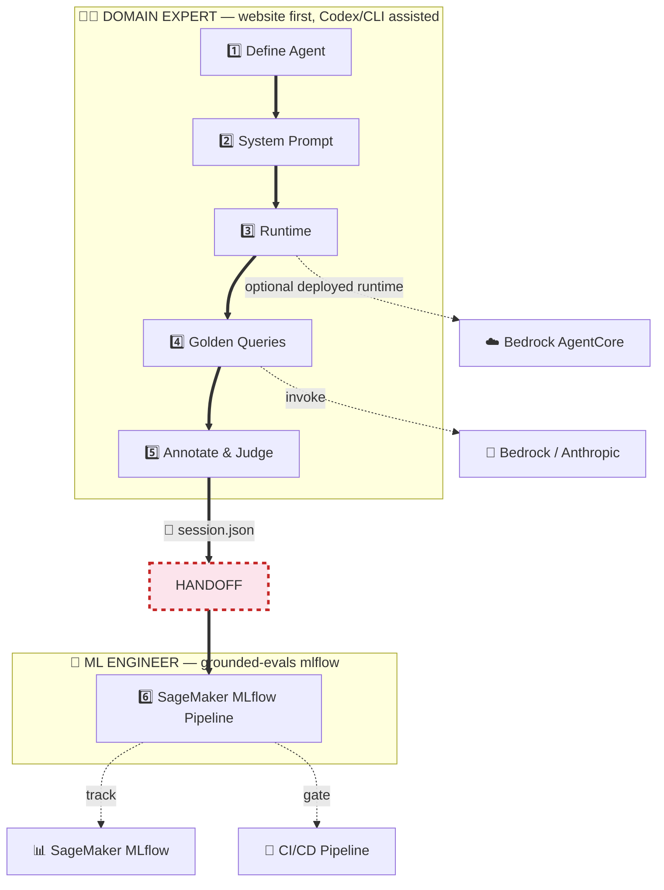
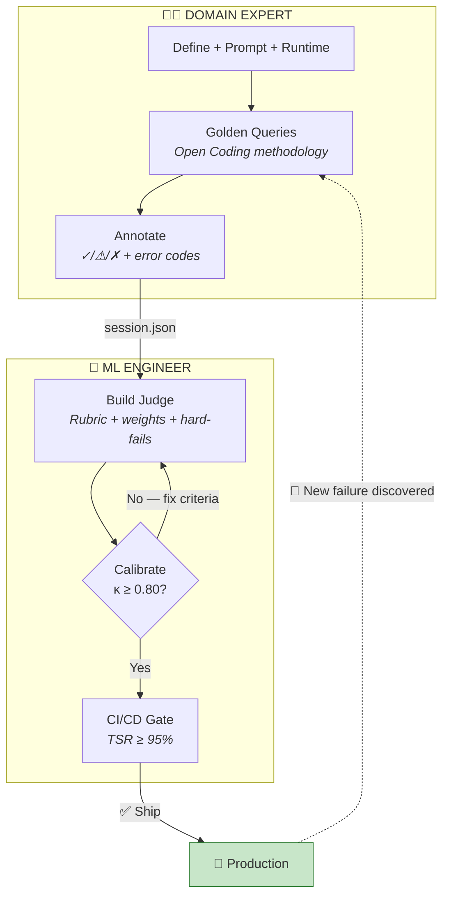
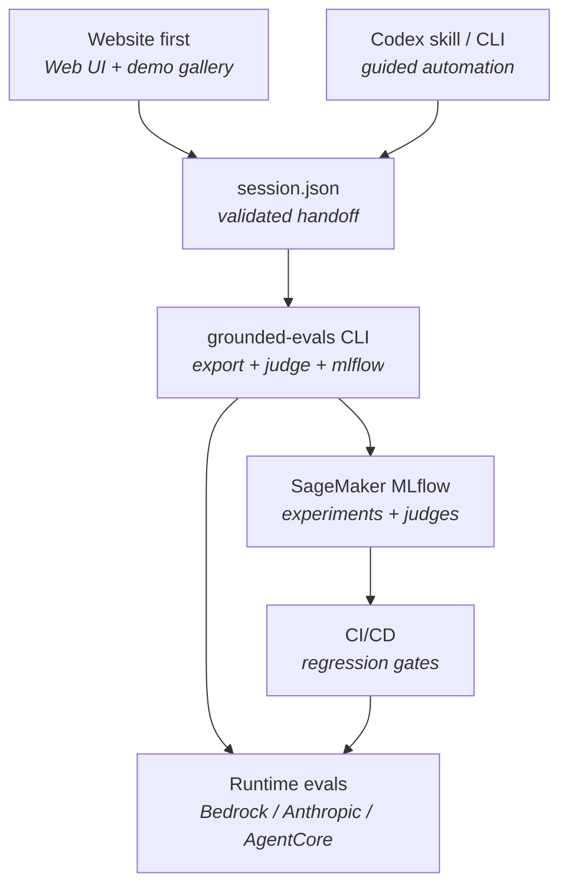

# GEDD — Grounded Eval-Driven Development for AI Agents

[](https://github.com/aws-samples/sample-GEDD/actions/workflows/ci.yml)
[](https://www.python.org/downloads/)
[](LICENSE)
[](https://github.com/aws-samples/sample-GEDD/stargazers)

You shipped an AI agent. Now you need to prove it works — to your CEO, to compliance, and to the team that inherits it. The agent fails in ways no rubric anticipated, while most eval tools expect you to know what to measure before you've seen what breaks.

**GEDD is the workflow for *before* you have a rubric.** A product manager or domain expert has a guided conversation, observes real agent behavior, names the failures in their own vocabulary, and hands engineering a validated `session.json` that can become an automated judge and CI gate.

> *The eval pipeline is the product. The agent is just the thing it produces.*


📖 [Why Grounded Theory? for reliable AI Agents](https://balachanderkeelapudi.substack.com/p/why-grounded-theory-for-reliable) — the long-form argument behind this repo.

---

## What GEDD Builds

GEDD turns domain expertise into production evaluation assets:

| Artifact | Created by | Why it matters |
|----------|------------|----------------|
| `session.json` | Domain expert workflow | Canonical handoff: agent spec, system prompt, golden queries, annotations, prompt variants, and chat history |
| Golden dataset | Open Coding | Queries that cover happy paths, edge cases, adversarial inputs, ambiguity, and multi-turn behavior |
| Failure codebook | Human annotation | Domain-specific failure vocabulary such as `dosage_unit_confusion`, not generic "bad answer" labels |
| Paradigm model | Axial Coding | Causal map of triggers, contexts, amplifiers, observed behavior, and user impact |
| Judge prompt | Selective Coding | G-Eval rubric with weighted criteria and hard-fail rules grounded in the expert's annotations |
| MLflow pipeline | ML engineer handoff | SageMaker experiment, custom judges, eval dataset, and CI/CD regression gates |

The goal is not to make a larger synthetic benchmark. It is to preserve expert judgment in a form engineering can automate.

---

## The Pipeline



**Two personas. Six steps. One file connects them.**

| Step | Who | What happens | Output |
|:----:|-----|-------------|--------|
| 1 | Domain Expert | "RxBot helps patients with medications" | Bounded context |
| 2 | Domain Expert | "Never prescribe. Always escalate." | System prompt + safety rules |
| 3 | Domain Expert | Choose local simulation or deployed runtime | Test runtime |
| 4 | Domain Expert | 20 test cases via Open Coding | Golden queries + responses |
| 5 | Domain Expert | ✓/⚠/✗ → name the failures | Error codes + G-Eval rubric |
| 6 | ML Engineer | `grounded-evals mlflow --run-eval` | SageMaker experiment + CI/CD gates |

> **Why runtime before testing?** Golden queries need realistic responses. By default, GEDD uses the saved system prompt with Bedrock or Anthropic. When AgentCore is configured, the same workflow can run against the deployed runtime so latency, IAM, and cold starts are included.

---

## Methodology

GEDD borrows from grounded theory because agent failures are often not knowable before you observe the agent in context.

| Grounded-theory step | In GEDD | Output |
|----------------------|---------|--------|
| Open Coding | Generate and annotate responses without forcing them into a pre-baked taxonomy | Golden queries, verdicts, memos, error codes |
| Constant Comparison | Check whether each new query or failure adds new coverage or repeats an existing pattern | Coverage signal and saturation checks |
| Axial Coding | Map failures into causes, contexts, intervening conditions, strategies, and consequences | Paradigm model and priority matrix |
| Selective Coding | Turn the dominant failure patterns into rubric dimensions and hard-fail criteria | Deployable LLM-as-a-Judge prompt |
| Calibration | Compare judge outputs against human annotations | Cohen's weighted kappa and per-criterion weak spots |

This keeps the rubric downstream of evidence. The expert observes what breaks first, then the judge is built from those observations.

---

## The Flywheel

The pipeline isn't linear — it's a loop. Production failures feed back into new test cases. The eval suite grows with the agent.



Each guide maps to a section of the flywheel:

| Guide | Covers | For |
|-------|--------|-----|
| [Pipeline Guide](grounded-evals/docs/pipeline-guide.md) | Full workflow + CI/CD YAML | Both |
| [Domain Expert Guide](grounded-evals/docs/domain-expert-guide.md) | Steps 1-5 walkthrough | PMs / SMEs |
| [PM → Production Judge](grounded-evals/docs/pm-to-ml-llm-judge.md) | Turn annotations into CI judge | ML Engineers |
| [Cohen's Kappa](grounded-evals/docs/cohens-kappa-for-llm-judges.md) | Calibrate judge-human agreement | ML Engineers |
| [Building an LLM Judge](grounded-evals/docs/building-llm-as-a-judge.md) | Rubric design + few-shot calibration | ML Engineers |

---

## Quick Start

<table>
<tr>
<td width="33%">

**1. Start The Website**
```bash
cd grounded-evals
pip install -e ".[dev]"
grounded-evals serve
```
Open `localhost:8080`
17 pre-loaded scenarios

</td>
<td width="33%">

**2. Use Codex Or CLI**
```bash
# In Codex, ask:
# Use $gedd to evaluate my AI agent
```

```bash
grounded-evals chat --session session.json
```

90 min → golden dataset + judge

</td>
<td width="33%">

**3. Engineer Handoff**
```bash
cd grounded-evals
pip install -e ".[dev]"
pip install sagemaker-mlflow

grounded-evals validate-session \
  --session session.json

grounded-evals mlflow \
  --session session.json \
  --tracking-uri $ARN \
  --run-eval
```

</td>
</tr>
</table>

The website is the default first experience because it lets a product manager or domain expert inspect completed demos, tag failures visually, map root causes, build judges, and export a handoff without learning command syntax.

---

## Web App Workflow

`grounded-evals serve` starts a NiceGUI app for workshops, stakeholder demos, and full annotation sessions. It runs in guest mode locally unless `ADMIN_PASSWORD` or Cognito is configured.

| Page | Purpose | What you do there |
|------|---------|-------------------|
| Home | Start or load work | Launch a new agent session or continue a saved one |
| Demos | Explore finished examples | Load one of 17 high-stakes domain demos with queries, annotations, codebooks, and judge prompts |
| Coach | Define the agent | Capture agent spec, system prompt, runtime choice, and golden queries |
| Eval Harness | Generate responses | Run golden queries against supported Bedrock/Anthropic models |
| Tag | Open Coding | Mark ✓/⚠/✗ responses, create failure codes, write memos, and track saturation |
| Root Causes | Axial Coding | Map codes into the paradigm model and priority matrix |
| Build Judge | Selective Coding | Convert codebook and root-cause analysis into judge dimensions, hard-fails, and calibration |
| Report | Handoff view | Review results, model performance, calibration health, and export artifacts |

The UI also supports session import/export from the top navigation so a domain expert can hand a completed session to an ML engineer without copying browser state.

---

## Codex Skill And Plugin

This repo includes Codex-native assistance for the same GEDD workflow:

| Asset | Path | Use |
|-------|------|-----|
| Repo skill | `.agents/skills/gedd/SKILL.md` | Auto-discovered when Codex runs inside this repository; invoke with `$gedd` or let Codex select it from matching requests |
| Plugin package | `plugins/gedd/` | Installable Codex plugin that bundles the GEDD skill for reuse beyond this repo |
| Repo marketplace | `.agents/plugins/marketplace.json` | Local plugin catalog entry pointing Codex at `./plugins/gedd` |

Use the skill when you want Codex to guide or automate the workflow while still making the website the first-touch experience:

```text
Use $gedd to evaluate my AI agent with the website-first workflow.
Use $gedd to package my current session for ML engineering handoff.
Use $gedd to build a judge from the domain expert's failure codes.
```

The skill is intentionally website-first. It should recommend `grounded-evals serve` before CLI automation unless the user explicitly asks for scripting, CI, MLflow, or headless execution.

---

## Session Handoff

The handoff artifact is the contract between the domain expert and the ML engineer. It contains the agent definition, system prompt, golden queries, annotations, prompt variants, chat history, and validation metadata.

```bash
grounded-evals validate-session --session session.json
grounded-evals handoff --session session.json --output rxbot_handoff_session.json
grounded-evals export --session session.json --format jsonl --output golden.jsonl
grounded-evals judge --session session.json --output judge.md
```

`validate-session` fails only on blocking issues such as a missing agent name, missing system prompt, or no golden queries. It warns when the dataset is still thin, for example fewer than 15 queries, fewer than 3 categories, missing expected behaviors, or no failure annotations yet.

For SageMaker MLflow:

```bash
pip install sagemaker-mlflow

grounded-evals mlflow \
  --session rxbot_handoff_session.json \
  --tracking-uri arn:aws:sagemaker:us-east-1:123456789012:mlflow-tracking-server/gedd-evals \
  --run-eval
```

That command creates an experiment, registers the golden dataset, logs human feedback metadata, and builds custom judges from the expert's error codes.

---

## What the Domain Expert Discovers

**This is the core reason GEDD exists:** domain experts discover failure modes that engineering teams are unlikely to name from the outside.

We tested across 4 domains. In every case, the expert caught failures an engineer would miss:

| Domain | Error Code | What Happened | Why Only an Expert Catches It |
|--------|-----------|---------------|-------------------------------|
| 💊 Pharmacy | `dosage_unit_confusion` | Said "mg" when context suggests "mcg" | 1000x error — potentially fatal |
| 🏠 Insurance | `coverage_hallucination` | Assumed policy exists without checking | Policyholder believes they're covered |
| 💰 Tax | `incomplete_guidance` | Didn't recommend CPA for $200K scenario | Liability issue in tax advice |
| 🛂 Immigration | `bar_misapplication` | Said 3-year bar applies to 90-day overstay | Bar triggers at 180+ days (INA §212(a)(9)(B)) |

> These are not generic "hallucination" labels. They are domain-specific failure modes in the expert's own vocabulary, and they become the criteria in the deployed judge.

The transformation is direct:

| Expert observation | GEDD captures | Engineering receives |
|--------------------|---------------|----------------------|
| "This says mg when the situation requires mcg." | `dosage_unit_confusion`, catastrophic severity, memo, example response | Hard-fail rule for critical unit mismatch |
| "This assumes coverage without reading the policy." | `coverage_hallucination`, policy context, affected user impact | Accuracy criterion requiring policy-grounded claims |
| "This sounds helpful but creates tax liability." | `incomplete_guidance`, risk memo, expected escalation behavior | Rubric anchor for required CPA escalation |
| "This misapplies the statutory overstay bar." | `bar_misapplication`, legal threshold, consequence | Legal accuracy criterion with explicit threshold check |

That is the difference between a generic judge and a judge a domain owner can defend.

---

## Architecture



AWS-native by default. IAM handles Bedrock auth, S3 stores artifacts, and SageMaker MLflow tracks experiments. A direct Anthropic API key is available for local fallback.

### Core Components

| Component | Location | Responsibility |
|-----------|----------|----------------|
| Conversational coach | `grounded_evals.agent` | Guides the expert through agent definition, prompt drafting, runtime selection, query generation, and annotation |
| Session model | `grounded_evals.guide` | Reads, writes, validates, imports, and exports `session.json` handoff state |
| Open Coding | `grounded_evals.open_coding` | Fractures domains into categories, compares query coverage, and checks saturation |
| Axial Coding | `grounded_evals.axial_coding` | Maps observed failure codes into root-cause dimensions and paradigm-model structure |
| Judge builder | `grounded_evals.judge_builder` | Builds rubrics, G-Eval prompts, few-shot variants, calibration, ensembles, and active-learning hooks |
| Web UI | `grounded_evals.ui` | Runs the multi-page NiceGUI app and preloaded domain demo gallery |
| CLI | `grounded_evals.cli` | Provides chat, eval, annotate, judge, handoff, export, and MLflow automation |

---

## 17 Demo Scenarios

No LLM calls needed. Each is pre-loaded with golden queries, annotations, error codes, and a generated judge.

<details>
<summary><b>View all 17 demos</b></summary>

| Demo | Domain | Key failure modes |
|------|--------|------------------|
| **TravelBot** | Flight booking | Hallucinated entities, fabricated booking data |
| **ClinicalBot** | Clinical triage | Missed escalation, contraindication miss |
| **LexBot** | Legal assistant | Jurisdiction error, unauthorized legal advice |
| **WealthBot** | Financial planning | Unlicensed advice, projection hallucination |
| **HRBot** | HR policy Q&A | Policy misquote, confidentiality breach |
| **EduBot** | Student learning | Answer reveal, grade inflation |
| **VaultEx AI** | Crypto exchange | Regulatory misguidance, fee hallucination |
| **PixelGuard** | Gaming moderation | False positive bans, harassment miss |
| **InsureBot** | Insurance claims | Bad-faith denial, coverage hallucination |
| **PropBot** | Real estate | Fair Housing steering, fabricated comps |
| **RxBot** | Pharmacy | Drug interaction miss, dosage unit confusion |
| **TaxBot** | Tax/accounting | Deduction hallucination, Circular 230 violation |
| **ClaimsBot** | Defense contracting | ITAR violation, CUI spillage |
| **FoodBot** | Food safety | Allergen cross-contact, HACCP temp error |
| **AutoBot** | Automotive | Lemon law omission, CARS Rule violation |
| **MigrateBot** | Immigration | Asylum deadline miss, bar misapplication |
| **EnergyBot** | Energy/utilities | Solar ITC outdated, NEM 3.0 confusion |

</details>

---

## CLI Reference

| Command | What it does |
|---------|-------------|
| `chat` | Guided coaching through Steps 1-5 |
| `eval` | Run golden queries against supported models |
| `annotate` | Mark responses ✓/⚠/✗ and assign error codes |
| `judge` | Generate a G-Eval judge prompt from annotations |
| `validate-session` | Check whether a session is ready for handoff |
| `handoff` | Write a validated handoff artifact |
| `mlflow` | Create SageMaker MLflow artifacts and optionally run evals |
| `export` | Write golden dataset as JSONL/CSV/JSON |
| `status` | Session dashboard |
| `analyze` | Map error codes to eval dimensions |
| `serve` | Start the web UI |
| `fracture` | Fracture domain into test categories |
| `check-saturation` | Check dataset coverage |
| `coverage` | Bar-chart breakdown by category |
| `compare` | Check if a new prompt adds unique coverage |

---

## Why This Works

Most eval tools ask: *what should we measure?* GEDD asks: *what is actually happening?*

- **You can't evaluate what you haven't observed.** Pre-baked rubrics miss your agent's unique failures.
- **Criteria are weighted by evidence.** A dosage unit confusion isn't the same severity as a tone slip.
- **Your evaluation evolves with the agent.** The flywheel absorbs new failure modes naturally.
- **Your work becomes load-bearing.** The judge is in *your* domain vocabulary, not generic "helpfulness 1-5."

---

## ⭐ Found this useful?

If GEDD helped you find what your agent gets wrong, **[a star](https://github.com/aws-samples/sample-GEDD)** helps others find it too.

---

License: MIT-0. See [LICENSE](LICENSE). Security: see [CONTRIBUTING](CONTRIBUTING.md#security-issue-notifications).
