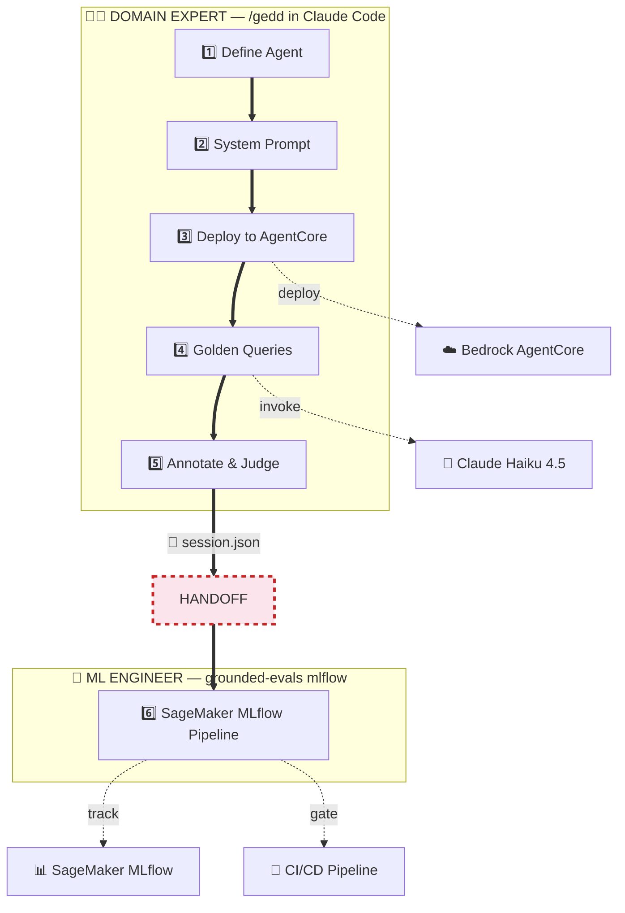
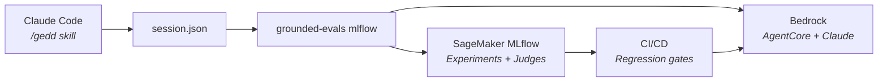

# GEDD — find what your AI agent gets wrong - A Claude Skill for Product Managers and Domain Experts

[](https://github.com/aws-samples/sample-GEDD/actions/workflows/ci.yml)
[](https://www.python.org/downloads/)
[](LICENSE)
[](https://github.com/aws-samples/sample-GEDD/stargazers)

You shipped an AI agent. Now you need to prove it works — to your CEO, to compliance, to the team that inherits it. The agent fails in ways no rubric anticipated, and the eval tools expect you to know what to measure before you've seen what breaks.

**GEDD is the tool for *before* you have a rubric.** A domain expert has a conversation, and 90 minutes later you have a production eval pipeline.

> *The eval pipeline is the product. The agent is just the thing it produces.*


📖 [Why Grounded Theory? for reliable AI Agents](https://balachanderkeelapudi.substack.com/p/why-grounded-theory-for-reliable) — the long-form argument behind this repo.

---

## The Pipeline



**Two personas. Six steps. One file connects them.**

| Step | Who | What happens | Output |
|:----:|-----|-------------|--------|
| 1 | Domain Expert | "RxBot helps patients with medications" | Bounded context |
| 2 | Domain Expert | "Never prescribe. Always escalate." | System prompt + safety rules |
| 3 | Domain Expert | One command → live endpoint | Agent on AgentCore |
| 4 | Domain Expert | 20 test cases via Open Coding | Golden queries + responses |
| 5 | Domain Expert | ✓/⚠/✗ → name the failures | Error codes + G-Eval rubric |
| 6 | ML Engineer | `grounded-evals mlflow --run-eval` | SageMaker experiment + CI/CD gates |

> **Why deploy before testing?** The agent only needs the system prompt. By deploying at Step 3, all golden queries run against the *real endpoint* — latency, IAM, cold starts included.

---

## The Flywheel

The pipeline isn't linear — it's a loop. Production failures feed back into new test cases. The eval suite grows with the agent.


Each guide maps to a section of the flywheel:

| Guide | Covers | For |
|-------|--------|-----|
| [Pipeline Guide](grounded-evals/docs/pipeline-guide.md) | Full workflow + CI/CD YAML | Both |
| [Domain Expert Guide](grounded-evals/docs/domain-expert-guide.md) | Steps 1-5 walkthrough | PMs / SMEs |
| [PM → Production Judge](grounded-evals/docs/pm-to-ml-llm-judge.md) | Turn annotations into CI judge | ML Engineers |
| [Cohen's Kappa](grounded-evals/docs/cohens-kappa-for-llm-judges.md) | Calibrate judge-human agreement | ML Engineers |
| [Building an LLM Judge](grounded-evals/docs/building-llm-as-a-judge.md) | Rubric design + few-shot calibration | ML Engineers |

---

## Quick Start

<table>
<tr>
<td width="33%">

**Domain Expert**
```bash
cd grounded-evals
pip install -e .
claude
```
```
/gedd
```
90 min → golden dataset + judge

</td>
<td width="33%">

**ML Engineer**
```bash
pip install sagemaker-mlflow

grounded-evals mlflow \
  --session session.json \
  --tracking-uri $ARN \
  --run-eval
```

</td>
<td width="33%">

**Explore Demos**
```bash
pip install -e ".[dev]"
grounded-evals serve
```
Open `localhost:8080`
17 pre-loaded scenarios

</td>
</tr>
</table>

---

## What the Domain Expert Discovers

We tested across 4 domains. In every case, the expert caught failures an engineer would miss:

| Domain | Error Code | What Happened | Why Only an Expert Catches It |
|--------|-----------|---------------|-------------------------------|
| 💊 Pharmacy | `dosage_unit_confusion` | Said "mg" when context suggests "mcg" | 1000x error — potentially fatal |
| 🏠 Insurance | `coverage_hallucination` | Assumed policy exists without checking | Policyholder believes they're covered |
| 💰 Tax | `incomplete_guidance` | Didn't recommend CPA for $200K scenario | Liability issue in tax advice |
| 🛂 Immigration | `bar_misapplication` | Said 3-year bar applies to 90-day overstay | Bar triggers at 180+ days (INA §212(a)(9)(B)) |

These aren't generic "hallucination" labels. They're domain-specific failure modes in the expert's own vocabulary — and they become the criteria in the deployed judge.

---

## Architecture



All AWS-native. IAM for auth. S3 for artifacts. No external services.

---

## 17 Demo Scenarios

No LLM calls needed. Each is pre-loaded with golden queries, annotations, error codes, and a generated judge.

<details>
<summary><b>View all 17 demos</b></summary>

| Demo | Domain | Key failure modes |
|------|--------|------------------|
| **TravelBot** | Flight booking | Hallucinated entities, fabricated booking data |
| **ClinicalBot** | Clinical triage | Missed escalation, contraindication miss |
| **LexBot** | Legal assistant | Jurisdiction error, unauthorized legal advice |
| **WealthBot** | Financial planning | Unlicensed advice, projection hallucination |
| **HRBot** | HR policy Q&A | Policy misquote, confidentiality breach |
| **EduBot** | Student learning | Answer reveal, grade inflation |
| **VaultEx AI** | Crypto exchange | Regulatory misguidance, fee hallucination |
| **PixelGuard** | Gaming moderation | False positive bans, harassment miss |
| **InsureBot** | Insurance claims | Bad-faith denial, coverage hallucination |
| **PropBot** | Real estate | Fair Housing steering, fabricated comps |
| **RxBot** | Pharmacy | Drug interaction miss, dosage unit confusion |
| **TaxBot** | Tax/accounting | Deduction hallucination, Circular 230 violation |
| **ClaimsBot** | Defense contracting | ITAR violation, CUI spillage |
| **FoodBot** | Food safety | Allergen cross-contact, HACCP temp error |
| **AutoBot** | Automotive | Lemon law omission, CARS Rule violation |
| **MigrateBot** | Immigration | Asylum deadline miss, bar misapplication |
| **EnergyBot** | Energy/utilities | Solar ITC outdated, NEM 3.0 confusion |

</details>

---

## CLI Reference

| Command | What it does |
|---------|-------------|
| `chat` | Conversational coaching (Steps 1-5) |
| `eval` | Run golden queries against a model |
| `annotate` | Mark responses ✓/⚠/✗ with error codes |
| `judge` | Generate G-Eval judge prompt |
| `mlflow` | Export to SageMaker MLflow (Step 6) |
| `export` | Write golden dataset as JSONL/CSV/JSON |
| `status` | Session dashboard |
| `analyze` | Map error codes to eval dimensions |
| `serve` | Start the web UI |
| `fracture` | Fracture domain into test categories |
| `check-saturation` | Check dataset coverage |
| `coverage` | Bar-chart breakdown by category |
| `compare` | Check if a new prompt adds unique coverage |

---

## Why This Works

Most eval tools ask: *what should we measure?* GEDD asks: *what is actually happening?*

- **You can't evaluate what you haven't observed.** Pre-baked rubrics miss your agent's unique failures.
- **Criteria are weighted by evidence.** A dosage unit confusion isn't the same severity as a tone slip.
- **Your evaluation evolves with the agent.** The flywheel absorbs new failure modes naturally.
- **Your work becomes load-bearing.** The judge is in *your* domain vocabulary, not generic "helpfulness 1-5."

---

## ⭐ Found this useful?

If GEDD helped you find what your agent gets wrong, **[a star](https://github.com/aws-samples/sample-GEDD)** helps others find it too.

---

License: MIT-0. See [LICENSE](LICENSE). Security: see [CONTRIBUTING](CONTRIBUTING.md#security-issue-notifications).
