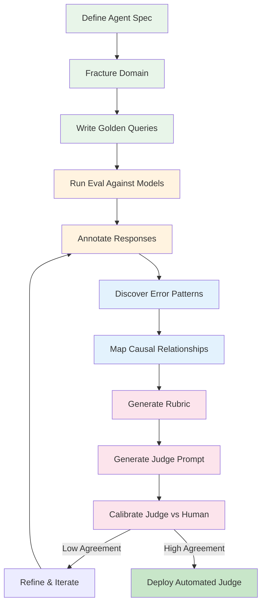
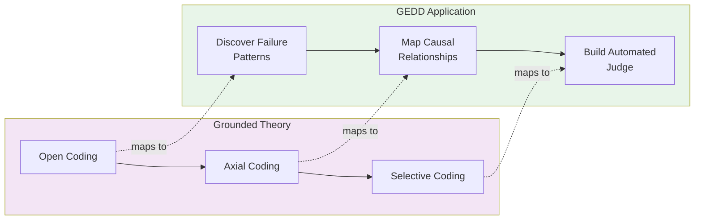
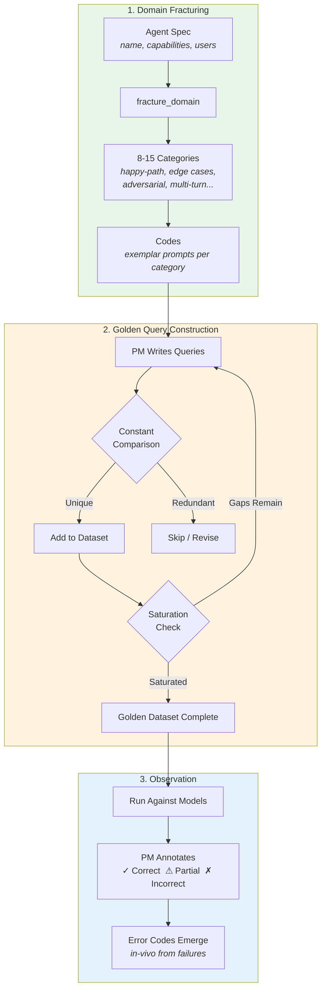
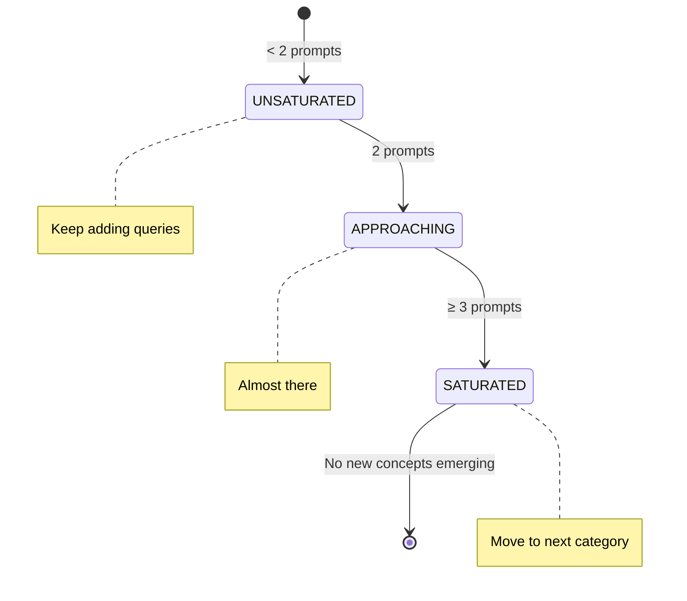
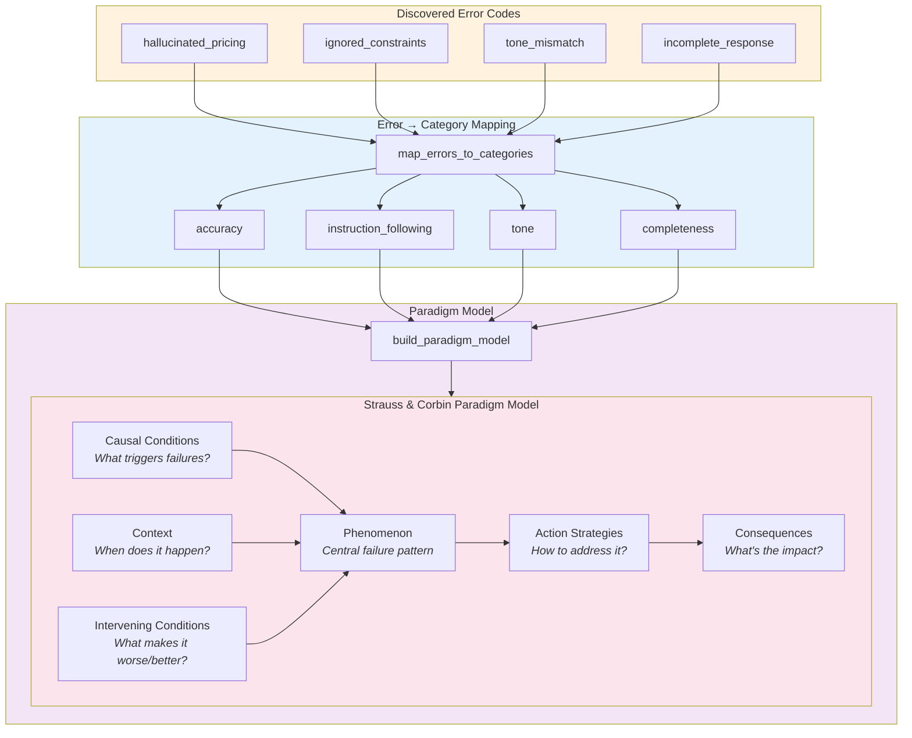
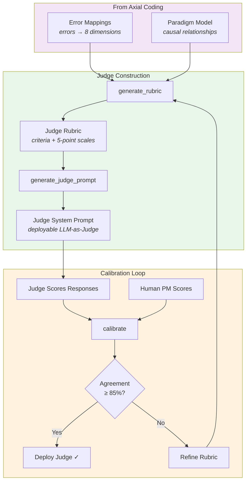
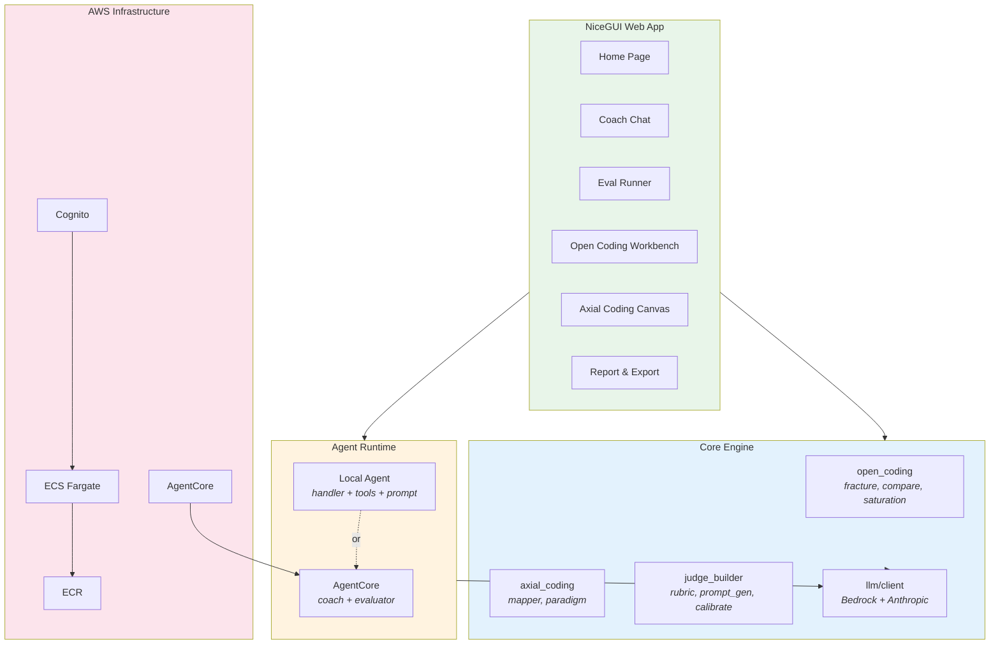

# GEDD — Grounded Eval-Driven Development


**Grounded Eval-Driven Development (GEDD)** is a problem-space framework for AI evaluation — purpose-built for product managers and domain experts who need to curate golden datasets for their AI products. It applies the same discipline you already use in product discovery (observe → understand → validate → build) to the problem of evaluating AI agents. Using qualitative research techniques from social science (Open Coding, Axial Coding, and the Paradigm Model), GEDD keeps you in the problem space — by observing real agent behavior, inductively coding failure patterns from data, and mapping the causal relationships that explain why your agent fails under specific conditions.

---

## The Problem

Traditional LLM evaluation starts with assumed rubrics: "check for helpfulness, accuracy, safety." But how do you know those are the right criteria for *your* agent? How do you weight them? What failure modes are you missing?

GEDD flips this: **observe first, theorize second.**

---

## How It Works — The GEDD Pipeline



---

## Qualitative Research Methodology

GEDD maps three phases of Grounded Theory to LLM evaluation:



| Grounded Theory Concept | GEDD Implementation |
|---|---|
| **Open Coding** — fracturing data into concepts | Break agent domain into testable categories, discover error codes |
| **Constant Comparison** — comparing each datum to existing | Each new query compared against existing set for uniqueness |
| **Theoretical Saturation** — stop when no new concepts emerge | Stop adding queries when categories are fully covered |
| **Axial Coding** — relating categories via Paradigm Model | Map errors to causal conditions, context, consequences |
| **Selective Coding** — identifying core category | Central failure phenomenon becomes primary eval criterion |
| **Memos** — researcher's documented rationale | PM documents reasoning behind each annotation |

---

## Phase 1: Open Coding

Open Coding is the inductive discovery phase. You break the agent's domain into testable pieces, then observe what actually happens.



### Key Concepts

- **In Vivo Codes** — Named in the PM's own words from observed failures (e.g., "hallucinated pricing")
- **Constructed Codes** — AI-suggested labels for patterns (e.g., "context_window_overflow")
- **Properties & Dimensions** — Each category varies along axes (complexity: low↔high, tone: casual↔formal)
- **Saturation** — A category is saturated when ≥3 prompts cover it and no new patterns emerge

### Saturation Model



---

## Phase 2: Axial Coding

Axial Coding connects the error patterns you discovered into a causal model. It answers: *why* do failures happen?



### The 8 Standard Evaluation Dimensions

Errors are mapped to these categories:

| Dimension | What It Measures |
|---|---|
| **Quality** | Overall response quality and coherence |
| **Accuracy** | Factual correctness, no hallucinations |
| **Brand Relevance** | Alignment with brand voice and guidelines |
| **Bias** | Fairness, no discriminatory patterns |
| **Safety** | No harmful, dangerous, or inappropriate content |
| **Completeness** | All parts of the query addressed |
| **Tone** | Appropriate register and style |
| **Instruction Following** | Adherence to constraints and directives |

---

## Phase 3: Judge Builder (Selective Coding)

The final phase transforms your qualitative analysis into a deployable automated judge.



### Generated Rubric Structure

Each criterion gets a 5-point scoring scale grounded in observed failures:

```
5 — Excellent: No issues observed
4 — Good: Minor issues, acceptable
3 — Adequate: Some issues, borderline
2 — Poor: Significant issues matching observed error patterns
1 — Failing: Critical failures (e.g., hallucinated_pricing, ignored_constraints)
```

The judge outputs structured JSON:
```json
{
  "scores": {"accuracy": 4, "completeness": 3, "tone": 5},
  "justifications": {"accuracy": "Minor imprecision in...", ...},
  "overall_score": 4.0,
  "pass": true,
  "summary": "Response meets criteria with minor accuracy gap."
}
```

---

## Architecture



---

## Quick Start

```bash
cd grounded-evals

# Create virtual environment
python -m venv .venv
source .venv/bin/activate

# Install in development mode
pip install -e ".[dev]"

# Run the app
python -m grounded_evals.app
```

The app runs at `http://localhost:8080`.

---

## Workshop Setup & Configuration

### Prerequisites

- Python 3.12+
- AWS account with [Amazon Bedrock model access](https://docs.aws.amazon.com/bedrock/latest/userguide/model-access.html) enabled
- AWS credentials configured (`aws configure` or environment variables)

### Step 1: Configure AWS Credentials

The app uses the standard boto3 credential chain. Ensure your credentials are set:

```bash
# Option A: AWS CLI profile (recommended for workshops)
aws configure

# Option B: Environment variables
export AWS_ACCESS_KEY_ID=your-access-key
export AWS_SECRET_ACCESS_KEY=your-secret-key
export AWS_SESSION_TOKEN=your-session-token   # if using temporary credentials
```

### Step 2: Choose Your LLM Provider

GEDD supports two LLM providers. Choose one:

#### Option A: Amazon Bedrock (Default — recommended for workshops)

Uses IAM credentials via boto3. No API key needed — just ensure your AWS account has Bedrock model access enabled.

```bash
# Set your region (must match where you enabled Bedrock models)
export AWS_REGION=us-east-1

# Optionally override the default model for the coaching agent
export BEDROCK_MODEL_ID=us.anthropic.claude-haiku-4-5-20251001-v1:0
```

#### Option B: Direct Anthropic API (local dev / no AWS)

If you don't have Bedrock access, use a direct Anthropic API key:

```bash
export ANTHROPIC_API_KEY=sk-ant-your-key-here
export BEDROCK_MODEL_ID=claude-sonnet-4-6-20250514   # uses Anthropic model names
```

> **Note:** When `ANTHROPIC_API_KEY` is set, it takes priority over Bedrock.

### Step 3: Change the Default Model

The default coaching model is `us.anthropic.claude-haiku-4-5-20251001-v1:0`. To change it:

**Via environment variable:**
```bash
export BEDROCK_MODEL_ID=us.anthropic.claude-sonnet-4-5-20241022-v2:0
```

**Via config file** (`configs/llm_config.yaml`):
```yaml
llm:
  provider: bedrock       # "bedrock" or "anthropic"
  region: us-east-1
  model_id: us.anthropic.claude-sonnet-4-5-20241022-v2:0
```

### Available Models for Evaluation

The eval runner supports these Bedrock models out of the box (select up to 3 for side-by-side comparison):

| Model | ID | API |
|---|---|---|
| Claude Haiku 4.5 | `us.anthropic.claude-haiku-4-5-20251001-v1:0` | Anthropic Messages |
| Claude Sonnet 4.5 | `us.anthropic.claude-sonnet-4-5-20241022-v2:0` | Anthropic Messages |
| Claude Opus 4.5 | `us.anthropic.claude-opus-4-5-20250115-v1:0` | Anthropic Messages |
| Amazon Nova Pro | `us.amazon.nova-pro-v1:0` | Bedrock Converse |
| Amazon Nova Lite | `us.amazon.nova-lite-v1:0` | Bedrock Converse |
| Amazon Nova Micro | `us.amazon.nova-micro-v1:0` | Bedrock Converse |
| Llama 3.3 70B | `us.meta.llama3-3-70b-instruct-v1:0` | Bedrock Converse |
| Mistral Large 24.11 | `us.mistral.mistral-large-2411-v1:0` | Bedrock Converse |

> **Workshop tip:** Ensure you have [requested access](https://docs.aws.amazon.com/bedrock/latest/userguide/model-access.html) to the models you want to use in the AWS Console under **Amazon Bedrock → Model access**.

### Step 4: Authentication (Optional)

For local/workshop use, the app uses a simple password login:

```bash
# Set a custom password (default: "playground2024")
export ADMIN_PASSWORD=your-workshop-password
```

For production, configure Cognito:
```bash
export COGNITO_USER_POOL_ID=us-east-1_xxxxxxx
export COGNITO_CLIENT_ID=your-client-id
```

### Step 5: Run the App

```bash
cd grounded-evals
python -m grounded_evals.app
```

Open `http://localhost:8080` and log in.

### All Environment Variables

| Variable | Purpose | Default |
|---|---|---|
| `AWS_REGION` | AWS region for Bedrock | `us-east-1` |
| `BEDROCK_MODEL_ID` | Model ID for coaching agent | `us.anthropic.claude-haiku-4-5-20251001-v1:0` |
| `ANTHROPIC_API_KEY` | Direct Anthropic API key (bypasses Bedrock) | — |
| `ADMIN_PASSWORD` | Login password | `playground2024` |
| `HOST` | Server bind address | `0.0.0.0` |
| `PORT` | Server port | `8080` |
| `COGNITO_USER_POOL_ID` | Cognito User Pool (production auth) | — |
| `COGNITO_CLIENT_ID` | Cognito App Client ID | — |
| `AGENTCORE_AGENT_ID` | Remote AgentCore agent ID | — |
| `LANGSMITH_API_KEY` | LangSmith tracing key (optional) | — |
| `LANGSMITH_PROJECT` | LangSmith project name | `agent-playground` |

### Troubleshooting

| Issue | Solution |
|---|---|
| `AccessDeniedException` on Bedrock calls | Enable model access in AWS Console → Bedrock → Model access |
| `NoCredentialProviders` | Run `aws configure` or set `AWS_ACCESS_KEY_ID` / `AWS_SECRET_ACCESS_KEY` |
| Wrong region error | Ensure `AWS_REGION` matches where you enabled Bedrock models |
| Models not responding | Check that the specific model ID is available in your region |
| Login not working | Default password is `playground2024` or set `ADMIN_PASSWORD` |

---

## Project Structure

```
grounded-evals/
├── src/grounded_evals/
│   ├── open_coding/        # Phase 1: Discover patterns
│   │   ├── fracture.py     #   Domain → categories + codes
│   │   ├── compare.py      #   Constant comparison method
│   │   └── saturation.py   #   Theoretical saturation checks
│   ├── axial_coding/       # Phase 2: Relate patterns
│   │   ├── mapper.py       #   Errors → 8 standard dimensions
│   │   └── paradigm.py     #   Build Paradigm Model
│   ├── judge_builder/      # Phase 3: Build judge
│   │   ├── rubric.py       #   Generate scoring rubric
│   │   ├── prompt_gen.py   #   Generate judge system prompt
│   │   └── calibrate.py    #   Human vs judge agreement
│   ├── agent/              # Conversational coach
│   │   ├── handler.py      #   Tool-use loop
│   │   ├── tools.py        #   6 coaching tools
│   │   └── prompt.py       #   Coach system prompt
│   ├── ingest/             # Input parsing
│   │   ├── parser.py       #   YAML agent spec parser
│   │   └── models.py       #   AgentSpec, Capability, Persona
│   ├── models/core.py      # All data models (Pydantic)
│   ├── ui/                 # NiceGUI pages
│   └── app.py              # App entry point
├── agentcore/              # AWS AgentCore runtime
├── infra/                  # CDK infrastructure
├── configs/                # Example YAML specs
└── tests/
```

---

## Deployment

Infrastructure is defined with AWS CDK:

```bash
cd infra
pip install -r requirements.txt
cdk deploy --all
```

Stacks: Network (VPC) → ECR → ECS Fargate (UI) → Cognito (auth) → AgentCore (agent runtime)

---

## Why Grounded Theory?

Most eval frameworks ask: "What should we measure?" — then build rubrics from assumptions.

Grounded Theory asks: "What is actually happening?" — then builds theory from evidence.

This matters because:
1. **You can't evaluate what you haven't observed** — Assumed rubrics miss failure modes unique to your agent
2. **Criteria should be weighted by evidence** — Not all dimensions matter equally for every agent
3. **Evaluation evolves** — As your agent improves, new failure patterns emerge; the methodology handles this naturally
4. **Calibration proves validity** — If your judge agrees with human annotators ≥85% of the time, your grounded criteria are working

---

## Security

See [CONTRIBUTING](CONTRIBUTING.md#security-issue-notifications) for more information.

## License

This library is licensed under the MIT-0 License. See the LICENSE file.
