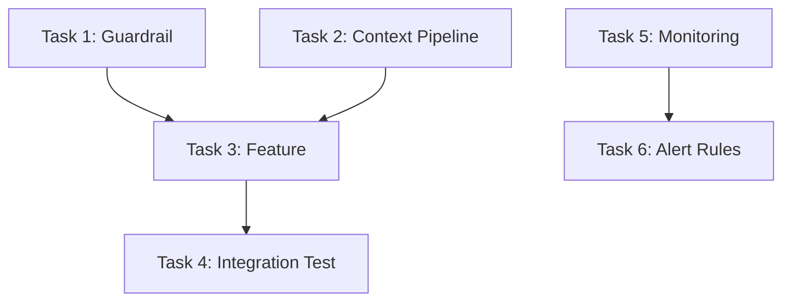

# Tasks Generation from GEDD Implementation Queue

Convert design decisions and prioritized failure codes into actionable implementation tasks.

## Prerequisites
- requirements.md generated from failure codes
- design.md generated from paradigm models
- Codebook with severity and frequency data
- Implementation queue priority scores

---

## Priority Calculation

Tasks are ordered by the GEDD priority score:

```
priority = severity × frequency × dimension_weight
```

This ensures engineering works on the highest-impact failures first.

### Priority Tiers

| Tier | Score Range | Treatment |
|------|-------------|-----------|
| P0 — Release Blocker | ≥ 40 | Must fix before next release |
| P1 — Critical | 20-39 | Fix in current sprint |
| P2 — Important | 10-19 | Fix in next sprint |
| P3 — Backlog | < 10 | Track, fix when convenient |

---

## Task Generation Rules

### Rule 1: One failure code → One or more tasks

Each failure code with severity ≥ 3 generates at least one task. Complex codes (multiple root causes) may generate multiple tasks.

### Rule 2: Tasks follow design decisions

Each task implements a specific design decision. The task references:
- Which design decision it implements
- Which requirement it satisfies
- Which failure code(s) it addresses

### Rule 3: Tasks include verification

Every task includes acceptance criteria that can be verified against golden queries:
- Which golden queries should pass after the task is complete
- What the expected behavior change is
- How to measure success (judge score improvement)

### Rule 4: Dependencies from paradigm model

Task dependencies reflect the causal chain in the paradigm model:
- Guardrails before features (prevent harm before adding capability)
- Infrastructure before application (context retrieval before response generation)
- Detection before mitigation (know when failure occurs before fixing it)

---

## Task Document Structure

Generate `.kiro/specs/{agent-name}/tasks.md` with this structure:

```markdown
# Tasks: {Agent Name} — Iteration {N}

## Task Dependency Graph



## Tasks

### Task 1: {Title — verb phrase describing the work}
- **Priority:** P{0-3} (score: {N})
- **Status:** not_started
- **Addresses:** {failure code label} (severity {N}, frequency {N})
- **Implements:** Design Decision {N} from design.md
- **Satisfies:** Requirement {N} from requirements.md

#### Description
{What needs to be built/changed and why, referencing the paradigm model root cause}

#### Acceptance Criteria
- [ ] {Golden query #{id} returns correct verdict after change}
- [ ] {Failure code "{label}" rate decreases by ≥{X}%}
- [ ] {Correctness property "{name}" holds}

#### Verification
```
Run golden queries: #{id}, #{id}, #{id}
Expected: All return verdict "correct"
Judge agreement: κ ≥ 0.80 on affected queries
```

#### Dependencies
- Depends on: {Task N — reason}
- Blocks: {Task N — reason}

### Task 2: ...
(repeat for each task)

## Summary

| Tier | Count | Failure Codes Addressed |
|------|-------|------------------------|
| P0 | {N} | {codes} |
| P1 | {N} | {codes} |
| P2 | {N} | {codes} |
| P3 | {N} | {codes} |

Total tasks: {N}
Estimated coverage: {X}% of observed failures addressed
```

---

## Task Types

### Guardrail Tasks
Address causal conditions by preventing bad inputs/outputs:
```
Task: Add pricing data validation guardrail
Addresses: "Hallucinated Pricing"
Type: Input/output filter
Verification: Queries about pricing without context → agent declines gracefully
```

### Context Pipeline Tasks
Ensure the agent has necessary information:
```
Task: Add pricing index to RAG pipeline
Addresses: "Hallucinated Pricing"
Type: Data pipeline
Verification: Queries about pricing with context → agent quotes accurate prices
```

### Prompt Engineering Tasks
Modify the system prompt to address behavioral failures:
```
Task: Add explicit pricing constraint to system prompt
Addresses: "Hallucinated Pricing"
Type: Prompt modification
Verification: System prompt includes "never invent prices" instruction
```

### Monitoring Tasks
Add observability for failure detection:
```
Task: Add pricing hallucination detection metric
Addresses: "Hallucinated Pricing"
Type: Monitoring
Verification: Dashboard shows pricing_hallucination_rate metric
```

### Test Tasks
Add automated verification:
```
Task: Add golden query regression test for pricing
Addresses: "Hallucinated Pricing"
Type: Testing
Verification: CI runs pricing-related golden queries on every deploy
```

---

## Completion Criteria

A task is complete when:
1. The implementation is deployed (or ready to deploy)
2. Affected golden queries return expected verdicts
3. The automated judge agrees with human annotations (κ ≥ 0.80)
4. The failure code rate has decreased measurably

## Iteration

After all P0/P1 tasks are complete:
1. Re-run the golden dataset against the updated agent
2. Re-annotate responses that changed
3. Check if failure rates decreased
4. Look for NEW failure patterns (the GEDD flywheel)
5. If new patterns → new annotation round → new requirements → new tasks
